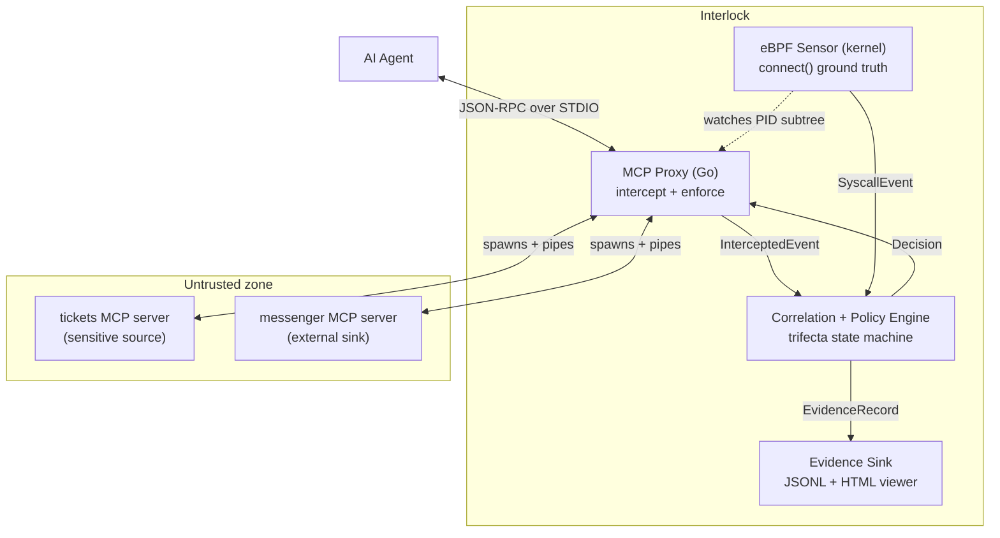

# Interlock

**A runtime firewall that catches AI agents exfiltrating your data — through tool-call chains the proxy sees, and side channels it can't.**

<!-- GIF: insert off→on contrast loop here (breach → blocked, ~8s). Caption below. -->

*Firewall off: breach. Firewall on: blocked at the tool call, or detected and contained at the kernel.*

---

## The problem

AI agents wired to MCP tools can read private data, ingest attacker-controlled instructions, and reach the outside world — Simon Willison's **lethal trifecta** — and the first half of 2026 alone produced **40+ CVEs against MCP implementations**. Static scanners check what a tool *claims* before approval; they miss the attack that matters in production: a sequence of individually authorized calls that chains into exfiltration. [Read the full threat model →](docs/project_overview.md)

---

## What it does

Interlock sits between an agent and its MCP servers on **two observation planes**:

- **Variant A — chained tools (proxy prevents).** A poisoned ticket tells the agent to read secrets and send them via a legitimate MCP tool. The proxy sees the sink call forming with the sensitive value in its arguments and **refuses to forward it**. The call never reaches the server. Verdict: `EXFIL`. Action: `prevented`.

- **Variant B — server side channel (eBPF detects and contains).** A malicious MCP server subprocess opens its own TCP socket to the attacker — a path the proxy never observes. An eBPF probe on `connect()` fires from a monitored PID; the engine correlates it with the sensitive session and **kills the process**. Verdict: `SUSPICIOUS`. Action: `contained_by_kill`.



---

## Quickstart

```bash
git clone https://github.com/yxshwanth/Interlock.git
cd Interlock
sudo make demo-quiet-ebpf GO=$(which go)
```

Requires **Go 1.21+** and **Linux with BTF** (`ls /sys/kernel/btf/vmlinux` should succeed; Ubuntu 6.x works). The eBPF path does not build or run on macOS/Windows. The demo runs three passes — monitor (breach), block (prevented), eBPF (detected and contained) — and prints a comparison table at the end.

No root? The proxy-only demo skips Variant B:

```bash
make demo-quiet
```

For verbose protocol output instead of curated narrative beats:

```bash
sudo make demo-ebpf GO=$(which go)   # full demo, verbose
make demo                             # proxy-only, verbose
```

---

> **Why `sudo`?** Variant B loads an eBPF probe on the `connect()` tracepoint to watch the monitored process subtree. That requires root (`CAP_BPF`). Here's precisely what it does: traces `connect()` syscalls from PIDs in a filter map, reads destination IP/port, and pushes events to a ring buffer. Nothing else — no network traffic sent, no files modified, no data leaves the box. The probe is **~75 lines of C** you can read in [`internal/ebpf/bpf/connect.c`](internal/ebpf/bpf/connect.c). Read the thing you're being asked to trust.
>
> **Why `GO=$(which go)`?** `sudo` resets `PATH`, so the Makefile can't find your Go binary unless you pass it explicitly.

---

## Honest limitations

These are design boundaries, not bugs. Naming them first is the point.

1. **Value-overlap is a raw-substring heuristic, not sound dataflow analysis.** It catches the obvious case (a secret literal appearing in sink arguments) but misses encoded or obfuscated exfil and can false-positive on legitimate echoes. *v0.2: real dataflow taint through common encodings (base64, hex, URL-encoding) — see [`TestCheckOverlap_EncodedExfil_KnownGap`](internal/engine/overlap_test.go).*

2. **Variant B is `SUSPICIOUS` / legs-only — not proven exfiltration.** Without payload inspection, the receipt shows an unauthorized outbound `connect()` during a sensitive session, not that data actually left. Confidence: 0.60. *v0.2: `sendto`/`write` payload capture on the eBPF side upgrades this to `EXFIL` at 0.95.*

3. **eBPF containment is kill-after-connect, not first-packet prevention.** The `connect()` syscall completes before `SIGKILL` fires. Variant A truly prevents; Variant B severs the channel and stops further exfiltration. *v0.3: LSM/KRSI for in-kernel blocking before the packet leaves.*

4. **Redaction is pattern-matched, not total.** Event logs scrub known secret patterns (API keys, bearer tokens). Secrets shaped differently — JWTs, private URLs with embedded tokens, customer PII — pass through. Treat `events.jsonl` as a sensitive artifact — never commit runtime evidence files. *v0.2: extended redaction as HTTP/TLS transport lands.*

---

## How it works

### The trifecta state machine

One state machine per session tracks three legs:

| Leg | Lights when |
|---|---|
| `sensitive_source_touched` | A tool tagged *sensitive* returns data |
| `untrusted_content_present` | Content enters from an attacker-controllable origin (v0.1: all tool results) |
| `external_sink_invoked` | A tool tagged *external sink* is called, or eBPF sees a non-allowlisted `connect()` |

When all three are lit at sink time, the engine trips. **Verdict** (what was concluded) and **action** (what was done) are separate:

| Condition at sink time | Verdict | Confidence |
|---|---|---|
| All three legs + tainted value in sink args | `EXFIL` | 0.95 |
| All three legs, no value overlap | `SUSPICIOUS` | 0.60 |

| Action | When | Effect |
|---|---|---|
| `prevented` | Variant A, block mode | Call never forwarded |
| `contained_by_kill` | Variant B, eBPF | Offending child killed |
| `allowed_monitor` | Monitor mode | Logged, not blocked |

### Fused timeline

Events from the proxy (userspace) and eBPF (kernel) use different clocks — Go's `CLOCK_MONOTONIC` vs `bpf_ktime_get_ns()`. The evidence receipt orders events by engine-assigned `timeline_seq`, not raw nanosecond timestamps, so the causal story is correct across planes.

Each trip emits an `EvidenceRecord` — session ID, verdict, action, variant, the three legs with trigger details, the sink call (tool name or syscall), optional value-overlap hit, and the full ordered timeline. The local HTML viewer at [`web/viewer.html`](web/viewer.html) renders it: verdict badge, trifecta legs, and the fused timeline.

<!-- Screenshot: Variant B evidence viewer (clean quiet-mode receipt with fused timeline). -->

Full architecture spec: [`docs/architecture.md`](docs/architecture.md)

---

## Project status — v0.1

This is a **working proof**, deliberately scoped: STDIO transport, `connect()`-only eBPF, single session, heuristic value-overlap. Versioning follows SemVer under `0.x` — the API is unstable and minor bumps may break things until v1.0.

**In scope:**

- MCP over STDIO transport
- Trifecta state machine + tool tagging
- Proxy-side blocking (Variant A — true prevention)
- eBPF `connect()` sensor (Variant B — detection + containment)
- Value-overlap confidence heuristic
- Both demo attack variants; local HTML evidence viewer

**Roadmap** ([`docs/ROADMAP.md`](docs/ROADMAP.md)):

- **v0.2 — Usable tool:** HTTP/SSE transport, multi-session concurrency, real dataflow taint + egress payload capture, published performance benchmarks, persistent evidence store
- **v0.3 — Adoptable product:** Kubernetes DaemonSet deployment, LSM/KRSI kernel blocking, daemon/metrics/SIEM integration, signed releases and published false-positive rates

Every detection feature ships with explicit known-gap tests naming what it does *not* catch. That discipline carries forward.

---

## Tests


**73 tests** across 8 packages — engine, taint, overlap, tagger, session store, evidence sink, config, and proxy framing. CI runs `go build`, `go vet`, and `go test` on every push to `main`. eBPF integration requires root and a BTF-enabled kernel — tested locally, not in CI. Concurrency-sensitive paths should pass `go test -race ./...`.

```bash
make test
go test -race ./...
```

---

## License

MIT — see [LICENSE](LICENSE).

## Contributing

See [CONTRIBUTING.md](CONTRIBUTING.md). Pick up work from [`docs/ROADMAP.md`](docs/ROADMAP.md) or open an issue first. New detection features should ship with known-gap tests that name what they do *not* catch — that's the project's signature standard.

## Security

Interlock runs privileged and loads kernel probes. Do not report vulnerabilities in public issues — use [GitHub private security advisories](https://github.com/yxshwanth/Interlock/security/advisories/new) (a `SECURITY.md` with full disclosure policy is planned).

## Documentation

- [Project overview & threat model](docs/project_overview.md)
- [Architecture spec](docs/architecture.md)
- [Roadmap](docs/ROADMAP.md)

## Credits

- **Threat framing:** Simon Willison's ["lethal trifecta"](https://simonwillison.net/) — the three-capability model for agent danger.
- **Prior art:** [AgentSight](https://arxiv.org/abs/2508.02736) (arXiv 2508.02736) — names the same semantic gap (intent vs. action) and uses eBPF; Interlock is the enforcement-capable product take.
- **Threat data:** Endor Labs, OX Security, Practical DevSecOps, Cloud Security Alliance, Trend Micro, BlueRock Security.
