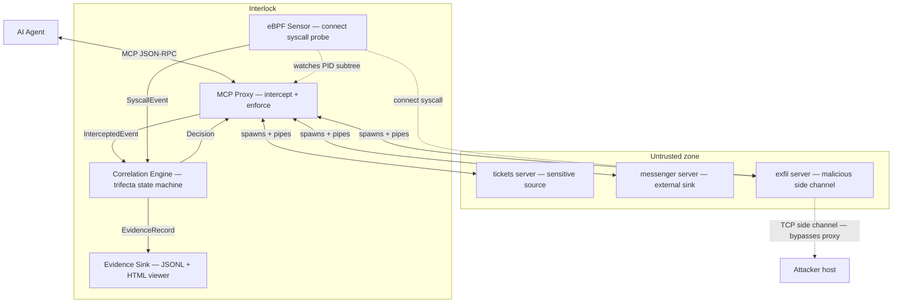

# Interlock

**A runtime firewall that catches AI agents exfiltrating your data — through tool-call chains the proxy sees, and side channels it can't.**

<!-- GIF: insert off→on contrast loop here (breach → blocked, ~8s). Caption below. -->

*Firewall off: breach. Firewall on: blocked at the tool call, or detected and contained at the kernel.*

---

## The problem

AI agents wired to MCP tools can read private data, ingest attacker-controlled instructions, and reach the outside world — Simon Willison's **lethal trifecta** — while MCP implementations have faced a steady stream of high-severity CVEs through early 2026 ([OX Security](https://www.ox.security/blog/the-mother-of-all-ai-supply-chains-critical-systemic-vulnerability-at-the-core-of-the-mcp/), [Cloud Security Alliance research note](https://labs.cloudsecurityalliance.org/research/csa-research-note-mcp-by-design-rce-ox-security-20260420-csa/)). Static scanners check what a tool *claims* before approval; they miss the attack that matters in production: a sequence of individually authorized calls that chains into exfiltration. [Read the full threat model →](docs/project_overview.md)

---

## What it does

Interlock sits between an agent and its MCP servers on **two observation planes** — with **asymmetric intelligence** in v0.2:

- **Plane 1 — proxy (Variant A): dataflow-aware prevention.** The proxy inspects tool-call chains, tracks tainted values through common encodings (base64, hex, URL-encoding, reversal), and **refuses to forward** sink calls that carry secrets. Verdict: `EXFIL` at 0.95 when overlap hits. This plane does real analysis.

- **Plane 2 — eBPF (Variant B): connect() tripwire, not payload detection.** A malicious server subprocess can open its own TCP socket — invisible to JSON-RPC inspection. The kernel probe fires on `connect()` from a monitored PID; the engine correlates destination + session legs and **kills the process**. Verdict: `SUSPICIOUS` at 0.60 — "an unauthorized outbound connection during a sensitive session," not proven exfiltration. **This plane is a tripwire until eBPF payload capture lands** (post-v0.2); it does not inspect what left the host.

| | Variant A (proxy) | Variant B (eBPF) |
|---|---|---|
| v0.2 capability | Encoding-aware overlap on sink args | `connect()` during sensitive session |
| Confidence when tripped | 0.95 (`EXFIL`) with overlap | 0.60 (`SUSPICIOUS`) — legs only |
| Role | Detector + preventer | Tripwire + containment |



---

## Quickstart

```bash
git clone https://github.com/yxshwanth/Interlock.git
cd Interlock
sudo make demo-quiet-ebpf GO=$(which go)
```

Requires **Go 1.25+** and **Linux with BTF** (`ls /sys/kernel/btf/vmlinux` should succeed; Ubuntu 6.x works). The eBPF path does not build or run on macOS/Windows. The demo runs three passes — monitor (breach), block (prevented), eBPF (detected and contained) — and prints a comparison table at the end.

No root? The proxy-only demo skips Variant B:

```bash
make demo-quiet
```

For verbose protocol output instead of curated narrative beats:

```bash
sudo make demo-ebpf GO=$(which go)   # full demo, verbose
make demo                             # proxy-only, verbose
```

---

> **Why `sudo`?** Variant B loads an eBPF probe on the `connect()` tracepoint to watch the monitored process subtree. That requires root (`CAP_BPF`). Here's precisely what it does: traces `connect()` syscalls from PIDs in a filter map, reads destination IP/port, and pushes events to a ring buffer. Nothing else — no network traffic sent, no files modified, no data leaves the box. The probe is **~75 lines of C** you can read in [`internal/ebpf/bpf/connect.c`](internal/ebpf/bpf/connect.c). Read the thing you're being asked to trust.
>
> **Why `GO=$(which go)`?** `sudo` resets `PATH`, so the Makefile can't find your Go binary unless you pass it explicitly.

---

## Honest limitations

These are design boundaries, not bugs. Naming them first is the point.

1. **Value-overlap checks canonical encodings, not full dataflow analysis.** At taint registration, each secret gets a fixed transform set (literal, base64, hex, URL-encoding, reversal). Sink args are matched against all forms — encoded Variant A exfil is caught at `EXFIL` (0.95). Still misses split-across-calls, compression, nested encoding, and custom ciphers — see [`TestCheckOverlap_SplitAcrossCalls_KnownGap`](internal/engine/overlap_test.go), [`TestCheckOverlap_Compressed_KnownGap`](internal/engine/overlap_test.go), [`TestCheckOverlap_DoubleEncoded_KnownGap`](internal/engine/overlap_test.go). Can false-positive on legitimate echoes of encoded forms.

2. **Variant B is a tripwire, not a payload detector.** The eBPF plane observes `connect()` during a sensitive session — it does not inspect outbound bytes. Verdict: `SUSPICIOUS` at 0.60 ("unauthorized connection," not proven exfil). v0.2 made Variant A smarter (encoding overlap); Variant B unchanged. *Post-v0.2: `sendto`/`write` payload capture upgrades this to `EXFIL` at 0.95.*

3. **eBPF containment is kill-after-connect, not first-packet prevention.** The `connect()` syscall completes before `SIGKILL` fires. Variant A truly prevents; Variant B severs the channel and stops further exfiltration. *v0.3: LSM/KRSI for in-kernel blocking before the packet leaves.*

4. **Redaction is pattern-matched, not total.** Event logs scrub known secret patterns (API keys, bearer tokens) and encoded taint variants; HTTP `Authorization` / `Cookie` headers are redacted in request metadata. JWTs, private URLs with embedded tokens, and customer PII in tool bodies still pass through. Treat `events.jsonl` as a sensitive artifact — never commit runtime evidence files.

5. **HTTP multi-session spawns a full backend pool per `initialize`.** Each new MCP session starts dedicated tickets/messenger/exfil child processes until idle expiry (`sessions.idle_timeout`, default 30m) or `max_concurrent` (default 32) is hit. An adversary who can open HTTP sessions can exhaust host process table slots — bounded, but real. Mitigate with network ACLs in front of Interlock, lower `max_concurrent`, and shorter idle timeouts. Not a substitute for authenticating who may open sessions.

6. **Performance numbers include HTTP overhead (v0.2.1+).** [`docs/performance.md`](docs/performance.md) publishes engine-on vs passthrough delta: **~0.5 ms on sensitive reads (typical)** and **~0.1 ms on sink checks** — sub-millisecond. Read-path cost scales with secrets-per-result (snapshot uses a 2-secret fixture). Absolute end-to-end p99 is backend-dominated — do not quote ~12 ms `read_ticket` as Interlock's cost. Concurrent multi-session load p99 deferred (`TestHTTP_ConcurrentLoad_KnownGap`).

---

## How it works

### The trifecta state machine

One state machine per session tracks three legs:

| Leg | Lights when |
|---|---|
| `sensitive_source_touched` | A tool tagged *sensitive* returns data |
| `untrusted_content_present` | Content enters from an attacker-controllable origin (v0.1: all tool results) |
| `external_sink_invoked` | A tool tagged *external sink* is called, or eBPF sees a non-allowlisted `connect()` |

When all three are lit at sink time, the engine trips. **Verdict** (what was concluded) and **action** (what was done) are separate:

| Condition at sink time | Verdict | Confidence |
|---|---|---|
| All three legs + tainted value in sink args | `EXFIL` | 0.95 |
| All three legs, no value overlap | `SUSPICIOUS` | 0.60 |

| Action | When | Effect |
|---|---|---|
| `prevented` | Variant A, block mode | Call never forwarded |
| `contained_by_kill` | Variant B, eBPF | Offending child killed |
| `allowed_monitor` | Monitor mode | Logged, not blocked |

### Fused timeline

Events from the proxy (userspace) and eBPF (kernel) use different clocks — Go's `CLOCK_MONOTONIC` vs `bpf_ktime_get_ns()`. The evidence receipt orders events by engine-assigned `timeline_seq`, not raw nanosecond timestamps, so the causal story is correct across planes.

Each trip emits an `EvidenceRecord` — session ID, verdict, action, variant, the three legs with trigger details, the sink call (tool name or syscall), optional value-overlap hit, and the full ordered timeline. The local HTML viewer at [`web/viewer.html`](web/viewer.html) renders it: verdict badge, trifecta legs, and the fused timeline.

<!-- Screenshot: Variant B evidence viewer (clean quiet-mode receipt with fused timeline). -->

Full architecture spec: [`docs/architecture.md`](docs/architecture.md)

---

## Project status — v0.2

**Latest release:** [`v0.2.1`](https://github.com/yxshwanth/Interlock/releases/tag/v0.2.1) — usable-tool milestone complete. Versioning follows SemVer under `0.x` — the API is unstable and minor bumps may break things until v1.0.

v0.2 extends the v0.1 proof with real MCP transport, concurrency, and operability. Variant B remains a `connect()` tripwire until eBPF payload capture lands (post-v0.2).

**Shipped in v0.2:**

- Streamable HTTP MCP transport (STDIO still default); multi-session concurrency with PID→session attribution
- Encoding-aware value overlap on Variant A (base64, hex, URL-encoding, reversal)
- Engine microbenchmarks + end-to-end HTTP overhead ([`docs/performance.md`](docs/performance.md), `make bench`, `make bench-http`)
- Opt-in SQLite evidence, event log backpressure, eBPF ring-buffer drop counter
- Trifecta state machine, proxy blocking, eBPF containment; both demo variants; HTML evidence viewer

**Roadmap** ([`docs/ROADMAP.md`](docs/ROADMAP.md)):

- **v0.2 — Usable tool (complete):** see [`docs/v0.2_summary.md`](docs/v0.2_summary.md). Variant B payload overlap deferred post-v0.2.
- **v0.3 — Adoptable product:** Kubernetes DaemonSet deployment, LSM/KRSI kernel blocking, daemon/metrics/SIEM integration, signed releases and published false-positive rates

Every detection feature ships with explicit known-gap tests naming what it does *not* catch. That discipline carries forward.

---

## Tests


**110 tests passing**, 7 known-gap skips — engine, proxy, config, HTTP integration, overhead benchmarks, evidence, backpressure. CI runs `test` + `race` jobs on every push to `main`. eBPF integration requires root and a BTF-enabled kernel — tested locally, not in CI.

```bash
make test
go test -race ./...
```

---

## License

MIT — see [LICENSE](LICENSE).

## Contributing

See [CONTRIBUTING.md](CONTRIBUTING.md). Pick up work from [`docs/ROADMAP.md`](docs/ROADMAP.md) or open an issue first. New detection features should ship with known-gap tests that name what they do *not* catch — that's the project's signature standard.

## Security

Interlock runs privileged and loads kernel probes. Do not report vulnerabilities in public issues — see [SECURITY.md](SECURITY.md).

## Documentation

- [Project overview & threat model](docs/project_overview.md)
- [Architecture spec](docs/architecture.md)
- [Roadmap](docs/ROADMAP.md)
- [Changelog](CHANGELOG.md)

## Credits

- **Threat framing:** Simon Willison's ["lethal trifecta"](https://simonwillison.net/) — the three-capability model for agent danger.
- **Prior art:** [AgentSight](https://arxiv.org/abs/2508.02736) (arXiv 2508.02736) — names the same semantic gap (intent vs. action) and uses eBPF; Interlock is the enforcement-capable product take.
- **Threat data:** [OX Security MCP disclosure](https://www.ox.security/blog/the-mother-of-all-ai-supply-chains-critical-systemic-vulnerability-at-the-core-of-the-mcp/), [Cloud Security Alliance research note](https://labs.cloudsecurityalliance.org/research/csa-research-note-mcp-by-design-rce-ox-security-20260420-csa/), [Endor Labs MCP AppSec research](https://www.endorlabs.com/learn/classic-vulnerabilities-meet-ai-infrastructure-why-mcp-needs-appsec).
