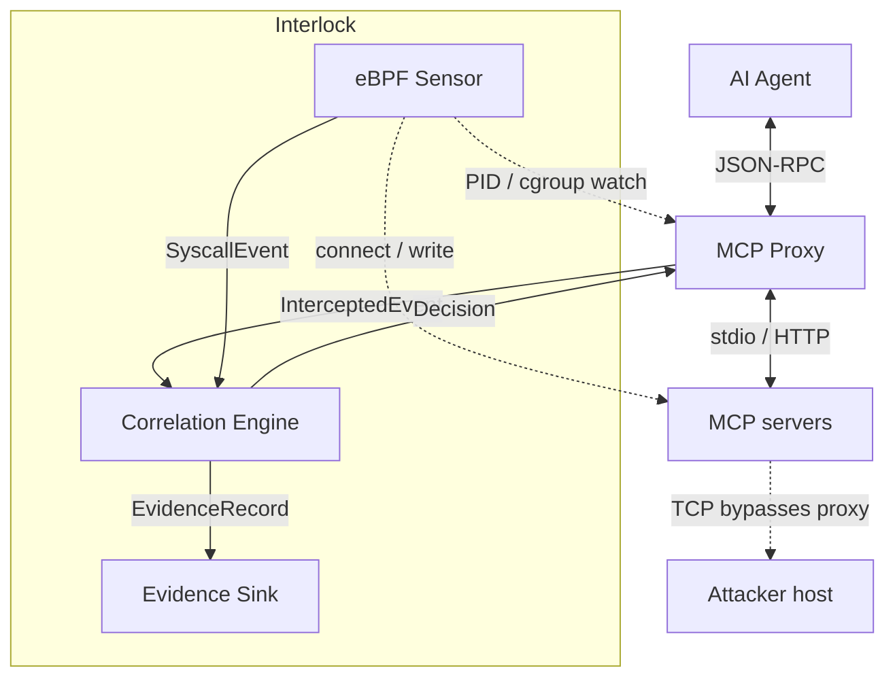

# Interlock

[](https://github.com/yxshwanth/Interlock/actions/workflows/ci.yml)
[](https://github.com/yxshwanth/Interlock/releases)
[](LICENSE)
[](https://go.dev/)
[](internal/ebpf/bpf/connect.c)
[](https://modelcontextprotocol.io/specification/2025-11-25/basic/transports/streamable-http)
[](#quickstart)

**A runtime firewall that catches AI agents exfiltrating your data - through tool-call chains the proxy sees, and side channels it can't.**

<p align="center">
  
</p>

<p align="center"><em>Firewall off: breach. Firewall on: blocked at the tool call, or detected and contained at the kernel.</em></p>

**Definitive reference:** [`docs/INTERLOCK.md`](docs/INTERLOCK.md) (mechanisms, TCB, gap ledger). This README is the landing page.

**Measured state** (snapshot; regenerate with `make fp-corpus` / `make cve-corpus`):

| Corpus | Headline |
|---|---|
| Self-authored FP corpus | EXFIL-tier detection **100%** (31/31); any-trip FP **18.9%** (7/37 soft); EXFIL-tier FP **0%** |
| CVE reconstructions | **12/15** reach EXFIL; **7/7** families have an EXFIL-shaped catch |

Live numbers live in [`docs/fp_corpus.md`](docs/fp_corpus.md) and [`docs/cve_corpus.md`](docs/cve_corpus.md).

---

## The problem

AI agents wired to MCP tools can hold Simon Willison's **lethal trifecta** in one session: private data, untrusted content, and external communication. Prompt injection into that mix is treated as ambient; Interlock does not claim to stop the model from being influenced. It moves the control plane to **exfiltration proof**: at sink time, did registered secret bytes (or a closed set of encodings) actually leave?

Static scanners, network policy, and chat guardrails each miss a different slice of that attack (definitions before approval; destinations without content; conversational surface without tool-result / side-channel bytes). Details and the alternatives table: [`docs/INTERLOCK.md`](docs/INTERLOCK.md) §1.

---

## What it does

Two observation planes, two attack variants, asymmetric enforcement:

| | Variant A (`A_chained_tool`) - MCP proxy | Variant B (`B_server_channel`) - eBPF |
|---|---|---|
| **Sees** | JSON-RPC tool args/results; hold-before-forward | `connect` / `write` / `writev` / `sendto` / `sendmsg` / DNS-on-53 / `openat` for filtered PIDs/cgroups |
| **Blind to** | Raw sockets from server processes | MCP tags/semantics; untrusted excerpts unless the [taint bridge](deploy/k8s/PRIVILEGE.md) supplies them |
| **Hard EXFIL** | Overlap in sink args → `prevented` (block mode) | Payload overlap → immediate `contained_by_kill`; opt-in LSM denies *repeat* `connect()` (`prevented`) |
| **Soft SUSPICIOUS** | AllLit + content-bind (or bare connect) → `allowed_monitor` | Same soft gates → `detected_only`; unreachable in proxy-less sensor-only without `register_untrusted` |

**EXFIL does not require all three trifecta legs.** `classifyTrip` returns EXFIL on overlap alone (taint can outlive soft-leg decay). Soft SUSPICIOUS requires `AllLit` plus bind / bare-connect / container-abort gates. See [`docs/INTERLOCK.md`](docs/INTERLOCK.md) §8.

**Deployment shape matters for Variant B:**

| Mode | Side channel |
|---|---|
| Proxy + opt-in `sandbox.netns` | **Prevented** (`CLONE_NEWNET`; children cannot reach the network) |
| Sensor-only DaemonSet | **Contained** (kill / optional LSM); Interlock did not spawn the pod, so netns does not apply |


```mermaid
flowchart TB
    Agent[AI Agent]
    Proxy[MCP Proxy]
    Servers["MCP servers"]

    subgraph tcb [Interlock]
        direction TB
        Engine[Correlation Engine]
        Ebpf[eBPF Sensor]
        Sink[Evidence Sink]
    end

    Attacker[Attacker host]

    Agent <-->|JSON-RPC| Proxy
    Proxy <-->|stdio / HTTP| Servers
    Proxy -->|InterceptedEvent| Engine
    Ebpf -->|SyscallEvent| Engine
    Engine -->|Decision| Proxy
    Engine -->|EvidenceRecord| Sink
    Ebpf -.->|PID / cgroup watch| Proxy
    Ebpf -.->|connect / write| Servers
    Servers -.->|TCP bypasses proxy| Attacker
```

---

## Quickstart

```bash
git clone https://github.com/yxshwanth/Interlock.git
cd Interlock
sudo make demo-quiet-ebpf GO=$(which go)
```

Requires **Go 1.25+** and **Linux with BTF** (`ls /sys/kernel/btf/vmlinux` should succeed; Ubuntu 6.x works). The eBPF path does not build or run on macOS/Windows. The demo runs three passes - monitor (literal secret breach), block (**gzip_base64** prevented), eBPF (**payload EXFIL** contained) - and prints a comparison table at the end.

No root? The proxy-only demo skips Variant B:

```bash
make demo-quiet
```

<p align="center">
  
</p>

```bash
sudo make demo-ebpf GO=$(which go)   # full demo, verbose
make demo                             # proxy-only, verbose
```

---

> **Why `sudo`?** Variant B loads eBPF probes on `connect()`, `write()`, `writev()`, `sendto()`, `sendmsg()`, and `openat()` for monitored PIDs/cgroups. That needs root (`CAP_BPF` / related caps). The demo money-shot uses local dial + `write()` payload overlap (`INTERLOCK_EXFIL_MODE=local`). Probes copy dest (IPv4/IPv6) and payload excerpts (default **1024** bytes = compiled `PAYLOAD_MAX`) onto **dual** ring buffers: routine (connect/openat) and critical (write/writev/sendto/sendmsg/`lsm_deny`). Source: [`internal/ebpf/bpf/connect.c`](internal/ebpf/bpf/connect.c).
>
> **Why `GO=$(which go)`?** `sudo` resets `PATH`, so the Makefile can't find Go unless you pass it.

---

## Honest limitations

Design boundaries, not unfinished TODOs. Full ledger: [`docs/INTERLOCK.md`](docs/INTERLOCK.md) §16; detection-scope write-up: [`docs/detection_boundary.md`](docs/detection_boundary.md).

1. **Closed transform set, not universal DLP.** Precomputed encodings (literal, base64, hex, URL, reversal, depth-2 nests, gzip/brotli/zstd/lz4_base64), fragment reassembly, decode depth default **5**, chunk match for long secrets, path-driven taint, and bounded ZIP/gzip/zlib/tar descent. Still misses **custom ciphers**, nests beyond clamp `[3,5]`, secrets **entirely** past the 1024 B capture window, **git pack / structured-protocol wire** outside ToolArgs/PayloadExcerpt (Named / demand-gated), and container bomb/encrypted/depth>2 aborts.

2. **Semantic / paraphrased exfil is out of scope for EXFIL.** Natural-language rewrite without a registered byte form does not prove EXFIL. Soft SUSPICIOUS may still fire on long *literal* shared substrings (byte-bind, not meaning).

3. **Variant B is syscall excerpts, not full stream inspection.** First EXFIL-carrying packet is always `contained_by_kill` (connect has no payload); LSM only stops *repeat* connects. Sensor-only without the taint bridge cannot light soft SUSPICIOUS. **DoH/DoT** and **blind boolean inference** are outside the observation model.

4. **Verdict ≠ action.** Monitor mode allows EXFIL through as `allowed_monitor`. Soft SUSPICIOUS never hard-blocks or kills. Collapsing those dimensions would break relevance-aware blocking.

5. **Redaction is pattern-matched, not total.** Treat `events.jsonl` / evidence as sensitive artifacts.

6. **HTTP multi-session spawns a backend pool per `initialize`.** Bounded by `sessions.max_concurrent` (default 32) and idle timeout (30m); still a process-table exhaustion surface without ACLs.

7. **Performance** is sub-millisecond engine delta on published fixtures ([`docs/performance.md`](docs/performance.md)); absolute end-to-end p99 is backend-dominated.

8. **Tool shadowing** is checked at registration only (mid-session re-registration KnownGap).

---

## How it works

### Trifecta legs (soft tripwire substrate)

| Leg | Lights when |
|---|---|
| `sensitive_source_touched` | Sensitive-tagged tool result, remote taint, or sensor sensitive `openat` seed |
| `untrusted_content_present` | Non-sensitive tool results (when configured); **not** on sensitive results or sensor `openat` alone. Sensor-only needs bridge `register_untrusted` |
| `external_sink_invoked` | External-sink tool call, or non-allowlisted eBPF egress |

Leg decay: TTL (default 30m) and call-count (default 32). Tainted values are retained after soft legs decay so late overlap can still EXFIL.

### Verdict vs action

| Condition | Verdict | Confidence |
|---|---|---|
| Tainted value overlaps sink args / egress payload (`CheckOverlap`) | `EXFIL` | 0.95 |
| AllLit + content-bind on a payload/args channel | `SUSPICIOUS` | 0.60 |
| AllLit + bare `connect()` (no payload channel) | `SUSPICIOUS` | 0.60 |
| AllLit + container inspect hard-cap abort | `SUSPICIOUS` | 0.60 |

| Action | When | Effect |
|---|---|---|
| `prevented` | Variant A EXFIL in block mode; or Variant B LSM *repeat* connect after EXFIL | Never forwarded / `-EPERM` |
| `contained_by_kill` | Variant B EXFIL | Immediate SIGKILL (no deferred window) |
| `allowed_monitor` | Variant A SUSPICIOUS, or monitor mode | Call goes through; evidence emitted |
| `detected_only` | Variant B SUSPICIOUS | Evidence only; no kill |

### Correlation and clocks

Attribution is **PID or cgroup → session**, then session state (legs + taint). There is no proxy↔syscall “recency window” join on timestamps.

Evidence clocks differ: proxy `ts_mono_ns` is actually `time.Now().UnixNano()` (wall); BPF uses `bpf_ktime_get_ns()` (boot-relative). Fuse timelines with engine-assigned `timeline_seq`, not raw nanoseconds ([`docs/INTERLOCK.md`](docs/INTERLOCK.md) §9).

Each trip emits a hash-chained `EvidenceRecord` (`make verify-evidence`). Viewer: [`web/viewer.html`](web/viewer.html).

| Variant A - `EXFIL` prevented (proxy) | Variant B - side channel contained (eBPF) |
|:---:|:---:|
|  |  |

---

## Project status - v0.4.0

**Latest tagged release:** [`v0.4.0`](https://github.com/yxshwanth/Interlock/releases/tag/v0.4.0).

**Shipped (highlights):**

- Streamable HTTP MCP (STDIO default); multi-session concurrency; PID→session via `(pid, start_time)`
- Encoding-aware overlap: depth-5 decoder, fragments, compressors, chunk match, path taint, container descent, egress reassembly
- Opt-in vault, `sandbox.netns`, spawn pinning, inherit sink suspicion
- Dual ringbufs; opt-in LSM quarantine + fail-closed breaker; evidence hash chain
- Sensor DaemonSet + taint bridge (SO_PEERCRED); Prometheus / webhooks / OCSF / SIGHUP
- FP + CVE corpora; [`docs/INTERLOCK.md`](docs/INTERLOCK.md) as SoT

**Next** ([`docs/ROADMAP.md`](docs/ROADMAP.md)): protocol dissectors remain demand-gated (§21).

### Kubernetes (sensor DaemonSet)

```bash
make image
kubectl apply -f deploy/k8s/rbac.yaml
kubectl apply -f deploy/k8s/daemonset.yaml          # privileged - kind / full EXFIL
# or: deploy/k8s/daemonset-capabilities.yaml        # managed try-first + taint_bridge
# or: make demo-k8s
```

Label workloads with `interlock.io/monitor: "true"`. Integrators keep their own MCP proxy/sidecar. On EKS, capabilities posture observes connect/write; production EXFIL under caps uses the **taint bridge**; soft SUSPICIOUS also needs `register_untrusted`. Details: [`deploy/k8s/PRIVILEGE.md`](deploy/k8s/PRIVILEGE.md).

---

## Tests

```bash
make test
go test -race ./...
make fp-corpus    # regenerates docs/fp_corpus.md
make cve-corpus   # regenerates docs/cve_corpus.md
```

CI runs `test` + `race` on `main`. Live eBPF saturation / LSM tests are root / BPF-LSM gated.

---

## License

MIT - see [LICENSE](LICENSE).

## Contributing

See [CONTRIBUTING.md](CONTRIBUTING.md). Prefer [`docs/ROADMAP.md`](docs/ROADMAP.md) or an issue first. New detection features should ship with KnownGap pins naming what they do *not* catch.

## Security

Interlock runs privileged and loads kernel probes. Do not report vulnerabilities in public issues - see [SECURITY.md](SECURITY.md). Self-threat model (T1-T6): [`docs/INTERLOCK.md`](docs/INTERLOCK.md) §12 / [`docs/threat_model.md`](docs/threat_model.md).

## Documentation

- **[INTERLOCK.md](docs/INTERLOCK.md) - definitive technical reference** (start here for architecture depth)
- [Detection boundary](docs/detection_boundary.md) - what we catch / do not
- [FP corpus](docs/fp_corpus.md) · [CVE corpus](docs/cve_corpus.md)
- [Architecture notes](docs/architecture.md) · [Roadmap](docs/ROADMAP.md) · [Performance](docs/performance.md)
- [Project overview](docs/project_overview.md) · [Changelog](CHANGELOG.md)

## Credits

- **Threat framing:** Simon Willison's ["lethal trifecta"](https://simonwillison.net/)
- **Prior art:** [AgentSight](https://arxiv.org/abs/2508.02736) (arXiv 2508.02736)
- **Threat data:** [OX Security MCP disclosure](https://www.ox.security/blog/the-mother-of-all-ai-supply-chains-critical-systemic-vulnerability-at-the-core-of-the-mcp/), [CSA research note](https://labs.cloudsecurityalliance.org/research/csa-research-note-mcp-by-design-rce-ox-security-20260420-csa/), [Endor Labs](https://www.endorlabs.com/learn/classic-vulnerabilities-meet-ai-infrastructure-why-mcp-needs-appsec)
