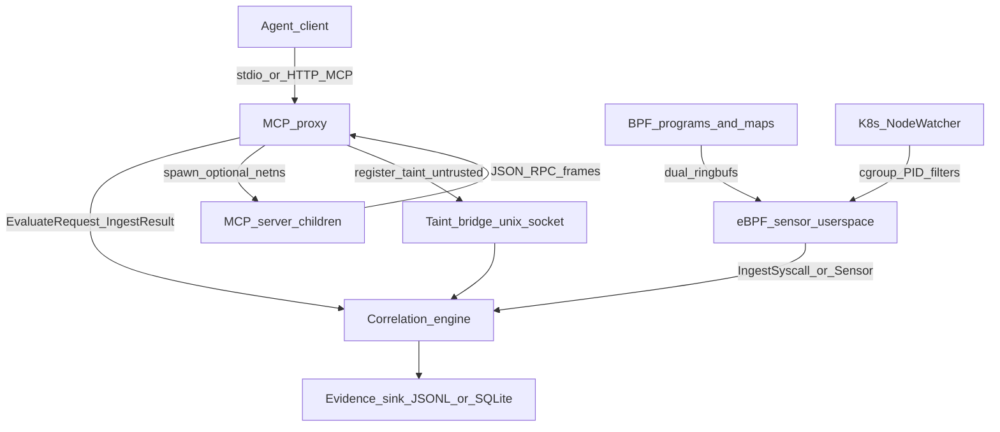
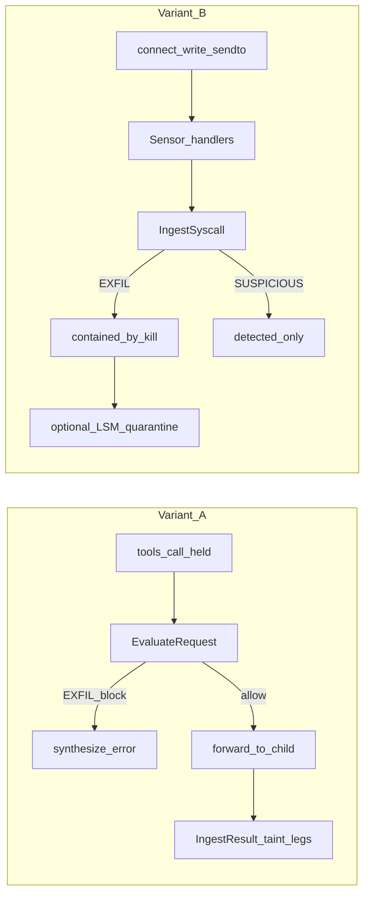
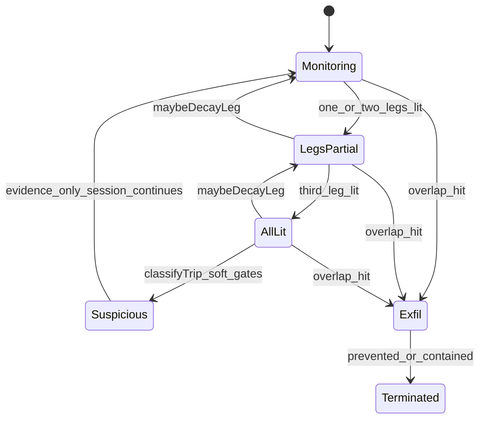
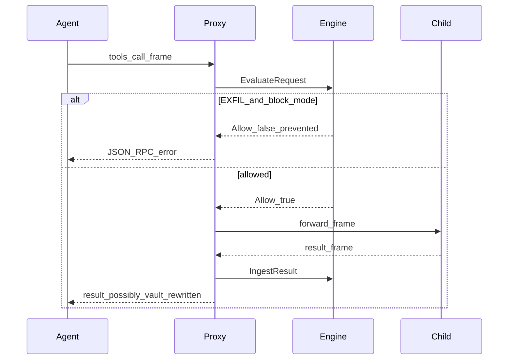

# Interlock - Definitive Technical Reference

This document is the single source of truth for Interlock: a runtime firewall that detects AI-agent data exfiltration across two observation planes (a userspace MCP proxy and a kernel eBPF sensor). Claims here are grounded in the implementation.

Companion artifacts (corpora, privilege notes, ROADMAP) remain useful for measured rates and deployment details; they are not a substitute for this reference.

**Read-path by audience** (this doc is written for four readers; pick a spine, then sample outward):

| Audience | Start here |
|---|---|
| Distributed systems / reliability | [§5](#5-plane-1---the-mcp-proxy), [§9](#9-the-correlation-engine), [§10](#10-fail-closed-and-resilience) |
| Kernel / eBPF | [§6](#6-plane-2---the-ebpf-sensor), [§12](#12-interlock-as-a-tcb) |
| AI / agent systems | [§1](#1-the-problem)–[§4](#4-the-trifecta-state-machine) |
| Security / adversarial | [§12](#12-interlock-as-a-tcb), [§16](#16-the-complete-gap-ledger), [§17](#17-considered-and-rejected) |

**Current measured state** (snapshot from `docs/fp_corpus.md` / `docs/cve_corpus.md` as of this writing; regenerate to confirm: `make fp-corpus`, `make cve-corpus`):

- Self-authored corpus: EXFIL-tier detection **100%** (31/31 non-gap malicious); any-trip FP **18.9%** (7/37 benign); EXFIL-tier FP **0%** (0/37). Mechanism and pins: [§4](#4-the-trifecta-state-machine), [§15](#15-the-validation-story).
- CVE reconstructions: **12/15** genuine reconstructions reach EXFIL; **7/7** families have an EXFIL-shaped catch. Methodology and misses: [§15](#15-the-validation-story).

These rates drift as corpora grow. The live numbers are whatever those two files say after regen; this block is a skimming snapshot, not a second source of truth.

---

## Table of contents

1. [The problem](#1-the-problem)
2. [Two-variant threat model](#2-two-variant-threat-model)
3. [Two-plane architecture](#3-two-plane-architecture)
4. [The trifecta state machine](#4-the-trifecta-state-machine)
5. [Plane 1 - the MCP proxy](#5-plane-1---the-mcp-proxy)
6. [Plane 2 - the eBPF sensor](#6-plane-2---the-ebpf-sensor)
7. [The taint system](#7-the-taint-system)
8. [Verdict vs action](#8-verdict-vs-action)
9. [The correlation engine](#9-the-correlation-engine)
10. [Fail-closed and resilience](#10-fail-closed-and-resilience)
11. [Tamper-evident evidence](#11-tamper-evident-evidence)
12. [Interlock as a TCB](#12-interlock-as-a-tcb)
13. [The data model](#13-the-data-model)
14. [Operability](#14-operability)
15. [The validation story](#15-the-validation-story)
16. [The complete gap ledger](#16-the-complete-gap-ledger)
17. [Considered and rejected](#17-considered-and-rejected)

---

## 1. The problem

### Why the lethal trifecta exists

An AI agent connected to tools is not dangerous because it can call any one API. It becomes dangerous when three capabilities coexist in a single session: access to private data, exposure to untrusted content, and the ability to communicate externally. Simon Willison named this the **lethal trifecta**. Any one leg is ordinary product behavior. All three lit together is the shape of data walking out, usually through **tool poisoning**: attacker instructions arrive inside a tool *result*, the model treats that result as trusted context, and a later authorized tool call or side-channel socket moves secrets.

Interlock’s threat model is that shape at runtime. The unit of detection is not a single tool definition and not a single network flow. It is a session that has touched sensitive material, absorbed untrusted content, and then invoked an external sink, with **proof** that secret bytes (or a registered encoding of them) appear in the sink.

### Why prompt injection is treated as unsolvable here

Prompt injection is a property of mixing untrusted text with privileged instructions in the same model context. No static allowlist of tools, and no pre-call scanner of tool schemas, removes that mixing once the agent is running and reading tool results. Treating “stop the model from being influenced” as the primary control asks the product to win an arms race against natural language. Interlock does not claim to solve injection. It treats injection as the ambient condition of agent systems and moves the control plane to **exfiltration prevention**: cut or contain the third leg when the session can be shown to be moving secrets.

That is a narrower claim on purpose. Byte- and encoding-overlap proof is decidable without trusting another model on the hot path. Semantic paraphrases of secrets are explicitly out of scope (see [§16](#16-the-complete-gap-ledger) and [§17](#17-considered-and-rejected)).

### Why existing defenses miss the chained-tool-call attack

| Defense | What it catches | What it structurally cannot see |
|---|---|---|
| **Static MCP / tool scanners** | Malicious or over-privileged *definitions* before approval; known bad package patterns | A sequence of individually authorized calls after approval; runtime result poisoning; secrets that only appear in live results |
| **Network policy / CNI egress** | Destinations outside an allowlist; coarse L3/L4 blast radius | Whether a permitted destination carries a secret; MCP JSON-RPC content; encoding transforms inside allowed HTTPS |
| **Model / gateway guardrails** | Heuristic refusal of obvious “send the key” prompts in chat | Opaque tool-result injection; side-channel sockets from MCP server processes that never appear as chat text; byte-level exfil that looks like a normal tool argument |

The attack Interlock is built for is **post-approval and sequence-shaped**: read private data → absorb attacker content → send. Static scanners stop at approval. Network policy stops at destinations. Guardrails stop at conversational surface. None of them hold a session-scoped taint store and ask, at sink time, whether those bytes are leaving.

**How to verify this yourself:** the product’s own detection boundary and corpus rates are pinned in `docs/detection_boundary.md`, `docs/fp_corpus.md`, and `go test ./internal/corpus/...` (also `make fp-corpus`). Those tests drive `Engine` directly; they are the measurable claim that EXFIL-tier precision holds on the authored attack shapes.

---

## 2. Two-variant threat model

There are exactly two ways secrets leave an MCP-connected agent under Interlock’s observation model, because there are exactly two places the bytes can be visible.

### Variant A - chained tool calls (`A_chained_tool`)

The agent (or a poisoned tool result) causes a later `tools/call` whose arguments contain the secret. That traffic is JSON-RPC on the MCP wire. The proxy sits on that wire, evaluates **before** forwarding (`EvaluateRequest` in `internal/engine/engine.go`), and can **prevent** the call (`ActionPrevented`) when overlap proves EXFIL under `enforcement: block`.

Constants live in `internal/model/model.go`:

```go
VariantA Variant = "A_chained_tool"   // caught by proxy hold-before-forward
VariantB Variant = "B_server_channel" // caught by eBPF sensor
```

### Variant B - server-side side channel (`B_server_channel`)

An MCP server process (or a child it spawns) opens its own TCP/UDP socket and writes the secret. That path never appears as JSON-RPC tool arguments. The proxy is blind to it. The eBPF sensor observes `connect` / `write` / `writev` / `sendto` / `sendmsg` / DNS-on-53 / `openat` from monitored PIDs or cgroups (`internal/ebpf/bpf/connect.c`), and userspace correlates payload excerpts against taint (`IngestSyscall` / `IngestSyscallSensor` in `internal/engine/engine.go`). Hard enforcement on EXFIL is **containment** (`contained_by_kill`), not prevention of the first packet.

### Why two planes, not one

| Plane | Sees | Blind to |
|---|---|---|
| MCP proxy | JSON-RPC methods, tool args, tool results, tags, hold-before-forward | Raw sockets from server processes; anything outside the framed MCP stream |
| eBPF sensor | Syscall-level connect/egress/openat for filtered PIDs/cgroups; payload excerpts | MCP semantics (which tool, which tags); untrusted-content excerpts unless the taint bridge supplies them |

Remove the proxy and you lose Variant A prevention, tool tagging, untrusted excerpts for content-bind, and (unless the bridge is wired) the soft SUSPICIOUS path in sensor-only mode. Remove the sensor and you lose every side channel that never touches `tools/call` arguments.

### What Interlock does not defend (and why)

| Non-goal | Why it is outside this tool |
|---|---|
| **Integrity attacks** (arbitrary file overwrite, planting hooks, RCE that never exfiltrates) | The threat model is data walking out, not host integrity. CVE reconstructions that only overwrite files are out of scope (`CVEOutOfScope` in `internal/corpus/scenarios_cve.go`). |
| **Semantic / paraphrased exfil** | Proof is overlap against registered encodings, not LLM judgment of meaning. Pin: `malicious_gap_semantic_paraphrase_exfil`. |
| **DoH / DoT** | Encrypted DNS needs TLS interception Interlock does not perform. Mitigate with network-layer DNS controls. |
| **Blind side-channel / boolean inference** | Secret bytes never appear on any inspected surface; overlap cannot fire. Rejected as EXFIL (ROADMAP §22). Pin: `cve_2025_66335_doris_blind_sql_injection_exfil_gap`. |

Deployment shape changes what Variant B *means* for prevention vs containment (next section).

---

## 3. Two-plane architecture

### Component topology



### Two-plane data flow



### Side-by-side: sight and blindness

| | Plane 1 (proxy) | Plane 2 (eBPF) |
|---|---|---|
| **Primary input** | `InterceptedEvent` / JSON-RPC frames | `SyscallEvent` from ring buffers |
| **Can prevent** | Yes: hold-before-forward on Variant A EXFIL | Repeat `connect()` only, if `ebpf.lsm_enforce` (LSM). First EXFIL packet: contain by kill after detection |
| **Taint source** | Sensitive tool results, path-driven reads, containers | `openat` path seed + `/proc/<pid>/root` contents (when privileged); remote taint via bridge |
| **Untrusted leg** | Non-sensitive tool results (`untrusted_origins.tool_results`) | Not from syscalls alone; `RegisterRemoteUntrusted` / bridge `register_untrusted` |
| **What breaks if removed** | No Variant A block; no MCP-native untrusted excerpts; no spawn/netns | No side-channel visibility; Variant B EXFIL impossible |

### Deployment modes: prevent vs contain the side channel

| Mode | Who spawns the workload | Variant B story |
|---|---|---|
| **Proxy mode** with `sandbox.netns: true` | Interlock (`StartServer` → `applySandboxNetNS` in `internal/proxy/sandbox_linux.go`) | Children get `CLONE_NEWNET` with an empty netns (loopback not brought up). Non-loopback connect fails with `ENETUNREACH` / `EHOSTUNREACH`. Side channel is **prevented** at spawn, not detected after the fact. Default `sandbox.netns` is **false** (opt-in; needs `CAP_SYS_ADMIN`). |
| **Sensor-only DaemonSet** | Not Interlock (kubelet / workload controller) | Interlock cannot wrap the pod in netns. Side channel is **contained**: payload overlap → SIGKILL (`contained_by_kill`); optional LSM stops *repeat* connects. See `deploy/k8s/PRIVILEGE.md`. |

Chose netns prevention in proxy mode over pretending the DaemonSet can do the same thing, because only the spawning parent can set `CLONE_NEWNET` before exec. That costs privilege (`CAP_SYS_ADMIN`) and breaks any legitimate outbound networking from sandboxed children (by design). Default payload capture is **1024** bytes (`PAYLOAD_MAX`).

---

## 4. The trifecta state machine

### The three legs

Per-session state is `model.SessionState` with `model.TrifectaLegs` (`internal/model/model.go`):

| Leg field | Meaning | How it lights |
|---|---|---|
| `SensitiveSourceTouched` | Private data was accessed | Sensitive-tagged tool result (`setSensitiveSourceTouched`); remote taint; sensor `openat` seed (`seedSensorSensitiveOpen`) |
| `UntrustedContentPresent` | Untrusted content entered context | Non-sensitive tool results when `untrusted_origins.tool_results` is true (`setUntrustedContentPresent`); stores excerpts for content-bind. Does **not** light on sensitive results or sensor `openat` alone. Bridge: `RegisterRemoteUntrusted` |
| `ExternalSinkInvoked` | External communication attempted | `external_sink` (or inherit-sink) tool call; eBPF non-allowlisted egress |

`AllLit()` requires all three `.Lit` flags. Soft `SUSPICIOUS` requires `AllLit` (plus bind / bare-connect / container-abort rules in `classifyTrip`). Hard `EXFIL` does **not** require `AllLit`: the first branch of `classifyTrip` is `if overlap != nil { return VerdictExfil }` and only afterward does the function call `AllLit()`. Overlap against retained taint is enough even if soft legs decayed (`internal/engine/engine.go`).

### Why three, not two, not four

**Not two.** Early sticky-leg designs treated “sensitive + sink” or “any three events nearby” as enough to hard-block. Content-blind sticky legs produced a measured **46.7%** any-trip false-positive rate on the benign corpus before ROADMAP §1. The untrusted leg exists so the soft tripwire has a poisoning story, and content-bind ties SUSPICIOUS to shared bytes with that untrusted material when a payload channel exists.

**Not four.** “Relevance,” “encoding form,” and “container abort” are **verdict qualifiers** inside `classifyTrip`, not additional sticky legs. Collapsing them into legs would reintroduce sticky content-blind state. Keeping them as evaluation-time gates preserves decay of the three soft legs while taint (the EXFIL substrate) remains.

### Leg decay

`touchSession` → `pruneLegs` → `maybeDecayLeg` (`internal/engine/engine.go`):

| Knob | Default | Rule |
|---|---|---|
| `trifecta.leg_ttl` | 30m | Clear leg if `now - LitAt >= TTL` |
| `trifecta.decay_after_calls` | 32 | Clear leg if `EventCount - EventsAtLit >= N` |

Either condition zeros the leg. Decaying untrusted also clears `UntrustedExcerpts`. Tainted values are **not** cleared by leg decay, so a late sink that still carries a secret can still EXFIL (`malicious_proxy_a_noisy_busy_session_late_exfil`).

**Plane asymmetry:** `IngestSyscall` lights `ExternalSinkInvoked` only if not already lit. `IngestSyscallSensor` **reassigns** the leg on every egress event, resetting `LitAt` / `EventsAtLit`. Sensor-mode TTL/call decay for that leg effectively restarts on each egress observation.

### State machine (detection gates)



### Case study: 46.7% → relevance-aware blocking

Before ROADMAP §1, sticky content-blind legs hard-blocked/killed on shapes that looked like “session once saw sensitive + later saw sink,” without proving secret movement and without requiring untrusted↔sink byte bind. The benign corpus measured **46.7%** any-trip FP under that regime.

§1 changed the doctrine in code:

1. Hard block/kill only on **EXFIL** (overlap).
2. `SUSPICIOUS` requires `AllLit` plus content-bind when a payload/args channel exists; bare `connect()` is the exception (no channel → AllLit alone).
3. Soft actions: Variant A `allowed_monitor`, Variant B `detected_only`.
4. Leg decay so poisoned sessions do not stay soft-tripping forever.

Current published rates (`docs/fp_corpus.md`):

| Metric | Value |
|---|---|
| Detection rate (EXFIL-tier, non-gap malicious) | **100.0%** (31/31) |
| Any-trip FP (benign) | **18.9%** (7/37) |
| EXFIL-tier FP (benign) | **0.0%** (0/37) |

The remaining 7 any-trip rows are intentional soft pins (`ExpectTripByDesign`), including connect-only AllLit noise and PEM-header content-bind collision. They are operator-visible soft alerts, not hard-enforcement false positives. Building the CVE corpus restored the connect-only tripwire (which §1’s content-bind had accidentally deleted for empty sinks) and moved any-trip from **13.3% (4/30) → 18.8% (6/32)** and later **18.9% (7/37)** after PEM collision pins. That movement is disclosed, not papered over.

**How to verify this yourself:** `go test ./internal/corpus/...` and `make fp-corpus`. Leg TTL pins: `benign_proxy_a_leg_ttl_decay_then_sink` / `benign_proxy_a_leg_ttl_still_lit_under_boundary`. Connect-only: `TestEngine_IngestSyscall_ConnectOnly_AllLit_Suspicious` in `internal/engine/engine_test.go`.

---

## 5. Plane 1 - the MCP proxy

### Why protocol-aware interception

MCP is JSON-RPC over newline-delimited frames (stdio) or Streamable HTTP. A generic L7 proxy that only sees bytes cannot aggregate `tools/list`, synthesize `initialize`, hold a specific `tools/call` until the engine returns a decision, or rewrite vault tokens in results. Interlock’s proxy *is* an MCP peer to the agent and an MCP client to each backend server (`internal/proxy/dispatch.go`, `internal/proxy/session_manager.go`).

### Framing (and why errors are silent and fatal)

`NewFrameReader` / `ReadFrame` in `internal/proxy/framer.go` read NDJSON lines, skip blanks, strip trailing `\r`, copy each line (scanner buffer reuse), and enforce **1 MiB** `maxFrameSize`. `WriteFrame` serializes writes under a mutex and rejects oversized frames.

A framing failure is not a soft warning path the engine can score. If the stream desynchronizes, subsequent “frames” are garbage; the session cannot be safely attributed. The proxy treats bad framing as terminal for that reader loop. Chose strict NDJSON over best-effort resync because a firewall that forwards mis-framed RPC is worse than one that drops the session.

### Hold-before-forward vs forward-then-inspect

`dispatchToolsCall` (`internal/proxy/dispatch.go`) calls `engine.EvaluateRequest` **before** `sc.writer.WriteFrame`. On deny it synthesizes a JSON-RPC error (`-32000`) and never forwards. On allow it registers a pending/sync wait (up to **30s**) for the response, then `deliverServerFrame` runs `IngestResult` (and optional `VaultRewriteFrame`) **before** delivering the result to the agent.

Chose hold-before-forward over forward-then-inspect because a blocking firewall that inspects after the secret has already left the child has already failed Variant A. The cost is latency: the agent waits for evaluate + backend round-trip; SSE streaming of blocked responses is forced to JSON (`internal/proxy/http/response.go`).

### Life of a `tools/call`



### Response synthesis

Not every method is forwarded. `dispatchInitialize` returns Interlock’s own `initialize` (`protocolVersion` `2025-11-25`, `serverInfo.name=interlock`) without talking to children. `dispatchToolsList` aggregates `rt.allToolsAsAny()` from session init. `dispatchPing` returns an empty result. Per-child init (`startAndInit` in `session_manager.go`) still does real `initialize` → `notifications/initialized` → `tools/list` as proxy-as-client before `readServerFrames`.

### Multi-session concurrency

`SessionManager` (`internal/proxy/session_manager.go`) gives each Interlock/MCP session an isolated `SessionRuntime` (servers, tool routes, pending waits). Defaults: `sessions.max_concurrent` **32**, `sessions.idle_timeout` **30m**. HTTP maps `Mcp-Session-Id` via `CreateMCP` / `GetByMCP`.

**Race:** `Create` checks the concurrent cap under lock, then unlocks before spawning. Concurrent creators can briefly exceed the cap. Chose unlock-before-spawn over holding the lock across process starts to avoid blocking all session creates on slow `exec`; the cost is a soft overshoot of the configured ceiling.

**Response race:** if the sync waiter times out and deletes `syncWait`, a late `deliverServerFrame` blocking send falls through to `agentWriter` (stdio) or is dropped (HTTP without agentWriter).

Tool routing is first-owner-wins; conflicts emit `ShadowEvent` via `engine.RecordToolShadowing`. Mid-session dynamic re-registration is a KnownGap (`TestToolShadowing_RuntimeReregistration_KnownGap`).

### PID → session attribution

`PIDRegistry` (`internal/proxy/pid_registry.go`) keys processes as `(PID, StartTimeNs)`. `ProcessStartTimeNs` (`proc_linux.go`) reads `/proc/<pid>/stat` field 22 (assumes `USER_HZ=100`) and returns **nanoseconds since boot** (starttime ticks × ns-per-tick). Lookup supports brief multi-key windows during reuse (`TestPIDRegistry_ReuseSafety`).

**Residuals (confirmed in code, two separate issues):**

1. **Epoch mix on the same field.** On `ProcessStartTimeNs` failure, `startAndInit` in `session_manager.go` stores `uint64(time.Now().UnixNano())` into `StartTimeNs`. That value is wall-clock nanoseconds since the Unix epoch, not ns-since-boot. Register and Unregister must still use the same stored value, so the session can function, but the field’s two code paths do not share an epoch. This is a registry-key consistency hazard under `/proc` read failure. It is **not** a comparison against eBPF timestamps: BPF events do not carry process start time, and `Lookup(pid)` takes only the PID.

2. **First-key wins while alive.** When `byPID[pid]` holds multiple keys and `processAlive(pid)` is true, `Lookup` returns the first entry in the slice immediately (`pid_registry.go`). It does not re-read `/proc/<pid>/stat` to select the key whose `StartTimeNs` matches the live process.

Chose `(pid, start_time)` over PID-alone because PID reuse would otherwise attribute a new process’s syscalls to a prior session’s taint and legs (T4 in [§12](#12-interlock-as-a-tcb)). The residuals above are what that design still leaves open under churn and `/proc` failure.

### Spawn-time validation and netns

At config load, `BuildResolvedSpawnCommands` / `ResolveSpawnExecutable` (`internal/config/spawn.go`) canonicalize paths (reject `..`, `Abs` + `EvalSymlinks`). At spawn, `ValidateSpawnCommand` (`internal/proxy/spawn.go`) requires the pinned path for that `serverID` or an entry on `sandbox.spawn_allowlist`. Chose pin-at-load over trust-at-exec to close a subset of OX-style malicious-command injection **when Interlock is the process that execs**; host-app config injection upstream of Interlock remains out of scope ([§15](#15-the-validation-story)).

`applySandboxNetNS` sets `CLONE_NEWNET` when enabled. Non-Linux builds reject netns (`sandbox_other.go`). SIGHUP cannot flip netns for already-running children.

### Enforcement gate order (`dispatchToolsCall`)

1. Unknown tool → error, blocked.
2. `Proxy.FailClosed()` → deny before engine.
3. `EvaluateRequest` under `recover`: panic → **this call fail-open** (`Allow: true`), `[SECURITY]` log, breaker notified.
4. Deny → synthesized block.
5. Vault `ForwardArgs` rewrite failure → refuse forward (fail-closed for that call).
6. Else forward + sync wait.

If `engine == nil`, the proxy logs FAIL-OPEN and forwards all (`proxy.go`).

**How to verify this yourself:** `go test ./internal/proxy/...` (concurrency, PID reuse, spawn, dispatch). NetNS behavior requires Linux + capability; see `sandbox_linux.go` and sensor/proxy integration tests gated appropriately.

---

## 6. Plane 2 - the eBPF sensor

### Why eBPF over ptrace / auditd

ptrace stops the traced process and does not scale to many MCP children or whole pods. auditd is log-oriented, not a dual-priority ring buffer with in-kernel PID/cgroup filters and an optional LSM deny path. eBPF tracepoints observe without blocking the syscall; userspace drains asynchronously; the optional LSM hook is the only in-kernel *policy* path Interlock attaches today.

Chose async ringbuf + userspace overlap over inline sockmap interception because sockmap would turn Interlock into a synchronous data-path proxy (rejected in [§17](#17-considered-and-rejected)). The cost is the first-packet containment window: detection runs after `connect()` succeeds and after some bytes may already be queued.

### Probe attachment and in-kernel filter

`NewLoader` (`internal/ebpf/loader.go`) attaches syscall tracepoints:

| Tracepoint | Event class |
|---|---|
| `sys_enter_connect` | Routine |
| `sys_enter_openat` | Routine |
| `sys_enter_write` / `writev` / `sendto` / `sendmsg` | Critical |

Optional: `link.AttachLSM` on `lsm_socket_connect` when `ebpf.lsm_enforce`. **Attach failure is non-fatal**: warn `[SECURITY]` and continue tracepoint-only.

In-kernel membership (`monitored_task` in `internal/ebpf/bpf/connect.c`): look up TGID in `pid_filter`, else `bpf_get_current_cgroup_id()` in `cgroup_filter`. Both maps are `BPF_MAP_TYPE_HASH` with **max_entries 256**. Empty filters → early return (no events).

Userspace updates filters via `Loader.UpdatePIDSet` / `AddCgroupID`. K8s prefers cgroup IDs for cross-PID-namespace safety (`CgroupIDFromPID` in `internal/k8s`).

### CO-RE / BTF reality

The C source `#include`s `bpf_core_read.h` and `vmlinux.h`; objects are generated with bpf2go (`internal/ebpf/generate.go`, amd64). Loading depends on kernel BTF (`/sys/kernel/btf/vmlinux`, mounted in the DaemonSet). A full-text search of `connect.c` finds **zero** `BPF_CORE_READ` / `bpf_core_*` read macro uses. Every dest/path/payload copy is `bpf_probe_read_user` or `bpf_probe_read_user_str` (userspace memory), not CO-RE kernel-struct field relocation. The include is present; the relocation macros are unused in the body. ARM/portability remains deferred on the ROADMAP.

### Dual ring-buffer design

| Ring | Map | Size | Types | Drop counter |
|---|---|---|---|---|
| Routine | `events` | 256 KiB | `EVENT_CONNECT`, `EVENT_OPENAT` | `drop_count` |
| Critical | `critical_events` | 256 KiB | write/writev/sendto/sendmsg/`EVENT_LSM_DENY` | `critical_drop_count` |

Reserve failure increments the matching counter (`inc_drop_count` / `inc_critical_drop_count`). Userspace runs `readLoopRoutine` and `readLoopCritical` (`Sensor.Start` in `internal/ebpf/sensor.go`).

Chose segregation so a `connect()` storm cannot starve EXFIL payload carriers or `lsm_deny` evidence (T1). The residual: flooding **write/sendto** still pressures the critical ring (KnownGap). On LSM deny, if critical reserve fails, the hook still returns `-EPERM` (deny is not evidence-dependent).

**How to verify this yourself:** `TestEBPF_RingbufSaturation_UnderLoad`, `TestLSM_DenySurvivesConnectFlood` (root / BPF-LSM gated) in `internal/ebpf`.

### Payload capture window

| Constant | Value | Where |
|---|---|---|
| `PAYLOAD_MAX` | 1024 | `connect.c` (compiled ceiling / struct size) |
| Runtime `payload_cap` | default 1024; userspace clamp **[64, 1024]** | `loader.go` `ClampPayloadCaptureBytes` |
| Path cap | `PATH_MAX_CAP` 128 | openat |

Limitations named in code: first iovec only for writev/sendmsg (verifier-safe); `fd < 3` skipped on write/sendto/sendmsg; `sendto` with NULL sockaddr skipped (connected sockets correlate via prior connect + `suspiciousByPID`). Secrets **entirely past** the window never appear in `PayloadExcerpt` (`malicious_gap_payload_truncated`, `TestCheckOverlap_PayloadTruncated_KnownGap`). Chunk matching can still EXFIL when a long-secret body chunk falls inside the window (ROADMAP §8).

### LSM `security_socket_connect` - honest scope

```c
// internal/ebpf/bpf/connect.c - lsm_socket_connect
// lookup lsm_blocklist_pid / lsm_blocklist_cgroup → emit EVENT_LSM_DENY → return -EPERM
```

Userspace arms quarantine after EXFIL / `ActionContained` via `Sensor.Quarantine` → blocklist maps. `ingestLSMDeny` records verdict `EXFIL`, action `prevented` (follow-up evidence; no second classify).

**Honest scope:**

- Stops **repeat** `connect()` after EXFIL was already confirmed.
- Does **not** move detection earlier. `connect()` has no application payload.
- The **first** EXFIL-carrying packet remains `contained_by_kill` after userspace overlap, never kernel-`prevented`. Pin: `TestIngestSyscall_FirstPacketStillContained_KnownGap`.
- Connect-only deny: does not block write/send on already-open sockets.
- Opt-in (`ebpf.lsm_enforce`, default false). Needs `CONFIG_BPF_LSM=y` and `"bpf"` in `/sys/kernel/security/lsm` (not default on stock Ubuntu).

### Containment: deferred kill removed

Older designs described a ~100 ms deferred-kill window (`scheduleContain` / `scheduleKill` / `flushDeferredKills` / `killLoop`). Those symbols are **absent** from current `internal/ebpf/sensor.go` (grep confirms; only a comment at the sendto path says “no deferred kill”). After ROADMAP §1, `SUSPICIOUS` never produces `ActionContained`, so that subsystem was unreachable dead code and was deleted rather than left describing a mechanism that cannot fire.

Current path: on `decision.Action == model.ActionContained` (EXFIL only via `variantBAction`), handlers call `containPIDs` immediately, which calls `KillProcess` (SIGKILL to process group + pid). No timer, no deferred queue. Bare `connect()` never kills alone; soft SUSPICIOUS is `detected_only`. `scripts/demo-k8s.sh` waits for demo delay + drain only.

### Allowlist and write↔connect correlation

Config `egress_allowlist` feeds `Sensor.allowlist`. `isAllowlisted` matches exact and normalized IPs. Allowlisted connect/sendto/named-sendmsg are ignored. Writes are processed only if the PID has a pending non-allowlisted connect within `SuspiciousConnectTTL` (**5 seconds**, `internal/ebpf/sensor.go`), or via self-contained sendto/sendmsg with destination.

This TTL is **not** a proxy↔syscall “recency window” (see [§9](#9-the-correlation-engine)).

### In-kernel vs userspace

| Layer | Responsibility |
|---|---|
| BPF (`connect.c`) | Filter membership; emit events; copy dest/payload/path; optional connect deny; drop counters |
| Loader | Load/attach/decode/maps |
| Sensor | Allowlist, connect↔write correlation, kill, quarantine arming, sensitive openat |
| Engine | Trifecta, taint, overlap, decisions, evidence |
| `internal/k8s` | Pod→PID/cgroup sync, attribution, optional `/proc` seed |

Privilege surface: `hostPID`, BTF/bpf/tracefs/cgroup hostPaths, caps `BPF`/`PERFMON`/`SYS_ADMIN`/`KILL` (or privileged). Caps DaemonSet often cannot read `/proc/<pid>/root` for openat seed without privileged or the **taint bridge** (EKS finding in `PRIVILEGE.md`).

---
## 7. The taint system

Taint is the substrate of EXFIL. Soft legs can decay; registered tainted values remain until the session ends. Every mechanism below is a trade-off: close an encoding or packaging attack, pay CPU/memory/FP surface, leave a named residual.

### Content-driven extraction

`secretPatterns` and `ExtractTaintedValues` in `internal/engine/taint.go` match:

1. Stripe-style `sk[-_](live|test)[-_]` keys
2. Generic `api[-_]?key[-_]?` tokens (length ≥ 16)
3. Bearer/token context captures (length ≥ 20)
4. `acct_` account IDs
5. PEM private key blocks (`BEGIN … PRIVATE KEY` … `END`, dotall)
6. PuTTY `.ppk` text (`PuTTY-User-Key-File-…` through `Private-MAC`)

On match, values are deduped, hashed (`HashValue` SHA-256 hex), masked (`MaskValue`), and given `CanonicalEncodings`. Raw `Value` / `Variants` / `Chunks` are memory-only (`json:"-"` on `TaintedValue`).

**Closes:** token-shaped and PEM/PuTTY secrets in sensitive results. **Costs:** regex FP surface (especially universal PEM headers interacting with content-bind). **Misses:** secrets that never match patterns and are not path-tainted; blind inference with no bytes (Doris gap).

Registration path (`IngestResult`): `extractResultText` (prefer MCP `content[].text`, then other JSON string leaves; `maxExtractDepth=8`, `maxExtractBytes=64KiB`) → fragment append → pattern extract on result and on joined fragments → path-driven consume → `taintFromContainer` → `attachChunksAll` → vault mint.

### Path-driven taint

`IsSensitiveResourcePath` / `TaintPathDrivenContent` in `internal/engine/path_taint.go`:

- Config `sensitive_paths` prefixes
- Extensions: `.p12`, `.pfx`, `.kdbx`, `.xlsx`, `.xlsm`, `.xls`, `.pem`, `.key`, `.crt`, `.cer`, `.jks`
- Basename substrings: `credentials`, `id_rsa`, `id_dsa`, `id_ecdsa`, `id_ed25519`, `secrets`, `kubeconfig`, `.aws`, `service-account`

`EvaluateRequest` stashes the first sensitive path from args (`stashSensitiveReadPath`). `IngestResult` consumes it and may register the **entire** trimmed blob as one tainted value. Sensor `seedSensorSensitiveOpen` uses patterns first; if empty and path sensitive, path-driven whole-blob taint.

**Closes:** binary credential containers and whole-file relays that never match token regexes (Excel CVE shape, ROADMAP §18). **Costs:** large taint blobs and FP if heuristics match benign paths. **Misses:** sensitive content at non-heuristic paths without config prefixes.

### Canonical encodings

`CanonicalEncodings` in `internal/engine/encoding.go` precomputes: `literal`, `base64`, `hex`, `url_encoded`, `reversed`, `base64_hex`, `hex_base64`, `base64_url`, `base64_reversed`, `gzip_base64`, `brotli_base64`, `zstd_base64`, `lz4_base64`.

Chose a fixed closed set over unbounded transform search because EXFIL must stay a decidable byte gate with 0% EXFIL-tier FP on the benign corpus. **Misses:** custom ciphers (`malicious_gap_custom_cipher`).

### Bounded recursive decoder

On overlap miss, `decodeMatchCandidates` (`internal/engine/decode.go`) unwraps base64 (Std + RawStd) and hex up to `CurrentMaxDecodeDepth()`. Defaults: `DefaultMaxDecodeDepth` **5**, clamp **[3, 5]** via `config.ClampMaxDecodeDepth`; `maxDecodeBytes` 8 KiB; `minDecodeCandidate` 4. Only continues if `plausibleDecoded` (≥80% printable or looks like hex/b64). After each unwrap, `matchSingleLayer` checks single-layer forms (not precomputed depth-2 nests, not compressor forms, not chunks).

**Why default 5:** EXFIL FP stayed **0.0%** at depths 3/4/5 (`TestCorpus_DecodeDepthFPCurve`); decode-miss latency stayed ~380-390 µs (`docs/performance.md`). The default was raised for detection reach (Fetch depth-5 nest CVE), not because deeper was free of cost forever: depth-6+ remains a NamedGap; clamp prevents operators from turning decode into an unbounded CPU sink.

### Cross-call fragment reassembly

`appendFragment` (`internal/engine/engine.go`): defaults 16 chunks / 64 KiB; trim trailing `\n`; FIFO eviction; trailing window if a single chunk exceeds budget. Re-scan joined buffer with `ExtractTaintedValues` on every sensitive result.

**Closes:** paginated / abutting secret halves (`malicious_proxy_a_cross_call_split`). **Costs:** memory per session. **Misses:** non-abutting splits and secrets larger than the budget window.

### Egress flow reassembly

`egressCandidatePayload` / `appendEgressFlowFragment`: enabled by default; 16 chunks / 4 KiB / 10s age / 32 flows; key `pid|ip:port`; DNS reassembles on leftmost label only (`normalizedEgressFragment`).

Overlap uses the reassembled string. **Content-bind still uses the single-event `PayloadExcerpt`**, not the join. Fragmented DNS can EXFIL while soft bind still sees one fragment.

**Closes:** normal DNS/write splitting (`cve_2025_65720_gpt_researcher_dns_fragmented_exfil`). **Misses:** slow trickle past `egress_fragment_max_age` (`malicious_gap_egress_slow_trickle`); cross-destination split (`malicious_gap_egress_cross_destination_split`). Unbounded reassembly was rejected ([§17](#17-considered-and-rejected)).

### Container descent and bomb defense

`InspectContainer` / `DefaultContainerLimits` in `internal/engine/container.go`: enabled; **10 MiB** decompressed; depth **2**; parts **100**; time **50 ms**. Kinds: ZIP (`PK\x03\x04`), gzip, zlib, tar (`ustar`). Abort reasons: size, depth, parts, time, encrypted, corrupt. Streaming reads via `readCapped` (32 KiB reads against remaining budget). Post-hoc size checks after full decompress fail against zip bombs; streaming caps exist because of that.

Overlap path prefixes `MatchForm` with `container_`. Abort → never EXFIL; soft SUSPICIOUS via `classifyTrip` when AllLit (`container_inspect_limit`). Taint path (`taintFromContainer`) extracts patterns from interiors only, not whole-archive blob taint.

**ZIP central-directory residual:** `zip.NewReader` builds the central directory before `MaxParts` can stop member iteration (named in code). That is a DoS/parse-cost residual inside the inspector, separate from the bomb caps on decompressed bytes.

**Closes:** extracted-cell and sink/egress-wrapped ZIP/zlib secrets on inspected bytes (ROADMAP §20). **Misses:** hard-cap aborts (`malicious_gap_container_inspect_bomb`); encrypted archives; depth > 2 nests; git pack wire framing outside ToolArgs/PayloadExcerpt (Named §21).

### Chunk matching

`ContiguousChunks` in `internal/engine/chunk.go`: for values ≥ `chunk_match_min_value_len` (default **64**), non-overlapping strides of `chunk_match_bytes` (default **32**); PEM/PuTTY armor stripped to body. Used after full-variant miss in `matchTaintedValue` (`overlap.go`). Not used in `matchSingleLayer` (decode path).

**Closes:** long secrets whose full form is truncated in the eBPF window but whose body chunk still appears (`cve_2025_53109_filesystem_escaperoute_pem_ebpf_capture_ceiling_gap`). **Misses:** secrets with zero bytes of any chunk inside the window (`malicious_gap_payload_truncated`).

### Overlap pipeline

`CheckOverlapLimited` (`internal/engine/overlap.go`):

1. `checkOverlapString` on raw sink args (variants then chunks)
2. Else `joinJSONStringValues` (DFS, sorted object keys) if different from raw
3. Else `checkOverlapDecoded`
4. Else `checkOverlapContainerCandidates`

`CheckOverlapPayloadLimited`: string → decode → container; `WhereFound = "egress payload"`. First hit wins.

### Content-bind vs overlap; vault

`CheckContentBind` (`internal/engine/bind.go`): sliding windows of `content_bind_min_len` (default **16**) between untrusted excerpts and sink payload. Soft SUSPICIOUS only; never EXFIL.

Vault (`internal/engine/vault.go`): opt-in; dummies `ilk.vault.` + first 16 hex of SHA-256; rewrite results; detokenize args only for allowlisted authorize tools on Allow path. Authorized-sink rehydration means a wrong allow still forwards the real secret (by design of authorize lists; pin `malicious_proxy_a_vault_authorized_wrong_dest`).

**How to verify this yourself:** engine unit tests under `internal/engine/*_test.go` (`TestCheckOverlap_*`, `TestCorpus_DecodeDepthFPCurve`, container/chunk/egress KnownGap tests) and `go test ./internal/corpus/...`.

---

## 8. Verdict vs action

### Why these are separate dimensions

**Verdict** answers: what did we conclude about this sink event? **Action** answers: what did enforcement do? Collapsing them into one enum breaks three load-bearing behaviors:

1. **Monitor mode** - same EXFIL verdict, action `allowed_monitor` instead of `prevented` (`proxyAction`).
2. **Relevance-aware blocking** - SUSPICIOUS can exist as a real detection without hard block/kill.
3. **Containment vs prevention** - Variant B EXFIL is `contained_by_kill`; Variant A EXFIL is `prevented`; LSM repeat is also `prevented`. Same word “caught” would erase whether the first packet could have left.

### Verdict / confidence (`classifyTrip`)

| Condition | Verdict | Confidence |
|---|---|---|
| `overlap != nil` | `EXFIL` | 0.95 |
| AllLit and `!hasPayloadChannel` (bare `connect`) | `SUSPICIOUS` | 0.60 |
| AllLit and `CheckContentBind` | `SUSPICIOUS` | 0.60 |
| AllLit and container inspect abort | `SUSPICIOUS` | 0.60 |
| Else | no trip | - |

Trust `classifyTrip` literally:

```go
// internal/engine/engine.go - classifyTrip
if overlap != nil {
    return model.VerdictExfil, 0.95, true  // before any AllLit check
}
if !state.Legs.AllLit() {
    return "", 0, false
}
// … soft SUSPICIOUS gates only after this …
```

EXFIL is overlap-alone. Soft legs can be fully decayed and EXFIL still fires if taint remains and overlap hits. AllLit gates SUSPICIOUS only. Model comments on `VerdictExfil` / `VerdictSuspicious` match this.

### Action tables

**Variant A** (`proxyAction`):

| Verdict | `enforcement: block` | `enforcement: monitor` |
|---|---|---|
| EXFIL | Allow=false, `prevented` | Allow=true, `allowed_monitor` |
| SUSPICIOUS | Allow=true, `allowed_monitor` | Allow=true, `allowed_monitor` |

**Variant B** (`variantBAction`):

| Verdict | Decision |
|---|---|
| EXFIL | Allow=false, `contained_by_kill` |
| SUSPICIOUS | Allow=true, `detected_only` |

**LSM deny** (`ingestLSMDeny`): Verdict=`EXFIL`, Action=`prevented`, Allow=false (repeat connect after quarantine). `ActionPrevented` covers Variant A block **or** LSM repeat quarantine.

---

## 9. The correlation engine

### Session isolation

`SessionStore` (`internal/engine/session_store.go`) keys all state by `sessionID`. Taints, legs, fragments, egress flows, vault, and excerpts do not cross sessions except via explicit `RegisterRemoteTaint` / `RegisterRemoteUntrusted` into a chosen ID (taint bridge).

### Attribution (how syscalls find a session)

Attribution is identity lookup, not a time join.

- **Proxy mode:** eBPF events carry PID; `PIDRegistry.Lookup(pid)` → `{session_id, server_id}` before `IngestSyscall` (`cmd/interlock/main.go`). `StartTimeNs` is part of the registry *key* at Register/Unregister (PID-reuse safety); `Lookup` itself takes only the PID (residuals in [§5](#5-plane-1---the-mcp-proxy) and T4).
- **Sensor/K8s mode:** cgroup → pod (`k8s:<uid>`) via `internal/k8s` attribution.
- **Unattributed:** not guessed - security audit + allow (fail-open by design for kill-without-attribution).

No path correlates a syscall to a proxy frame by comparing `ts_mono_ns` values. Once `sessionID` is set, the engine evaluates against that session’s already-held legs and taints.

### Event ordering across two clock domains

Event *timestamps* are a separate concern from attribution. They matter for evidence display, not for binding a syscall to a session.

| Source | Code | What the number actually is |
|---|---|---|
| Proxy `InterceptedEvent.TSMono` (`json:"ts_mono_ns"`) | `Session.CreateEvent` in `internal/proxy/proxy.go`: `TSMono: time.Now().UnixNano()` | Wall-clock nanoseconds since the Unix epoch. Despite the field name, this is **not** Go’s monotonic clock (`runtime nanotime` / `time.Since` base). |
| BPF event `ts_ns` → `SyscallEvent.TSMono` | `bpf_ktime_get_ns()` in `connect.c`; copied in `sensor.go` handlers | Boot-relative nanoseconds (BPF CLOCK_MONOTONIC class). Does not track wall-clock `settimeofday` / NTP steps the way UnixNano does. |

Sorting a fused evidence timeline on raw `ts_mono_ns` across planes is therefore meaningless: the integers are not on a shared axis. Evidence items get engine-assigned `timeline_seq` (1-based causal order in `buildEvidence` / `buildEvidenceVariantB`). `TimelineItem` comments in `internal/model/model.go` say explicitly: sort on `timeline_seq`, not `ts_mono_ns`.

Do not confuse evidence clocks with the PID-registry `StartTimeNs` residual in [§5](#5-plane-1---the-mcp-proxy). That field is an identity key (boot-relative from `/proc`, or wall UnixNano on fallback). BPF events never carry it; attribution does not join on timestamps.

### Time windows (not a proxy↔syscall join)

There is **no** sliding “recency window” that joins a syscall to a recent proxy frame by timestamp. Correlation is: attribute PID/cgroup → `sessionID`, then evaluate against that session’s already-held legs and taints. Closest real time windows:

| Window | Default | Purpose |
|---|---|---|
| `SuspiciousConnectTTL` | 5s | Sensor write↔prior connect correlation |
| `leg_ttl` | 30m | Soft-leg expiry |
| `decay_after_calls` | 32 | Soft-leg expiry |
| `egress_fragment_max_age` | 10s | Egress reassembly idle reset |

If you need a mental model: the session state *is* the join; it is not a fuse of “events within N ms of each other.”

**How to verify this yourself:** read `buildEvidence` timeline construction in `internal/engine/engine.go` and `SuspiciousConnectTTL` usage in `internal/ebpf/sensor.go`. Unattributed path: `recordUnattributedSyscall`.

---

## 10. Fail-closed and resilience

### Default fail-open

`failclosed.New` returns **nil** when `fail_closed.enabled` is false (`internal/failclosed/breaker.go`). All breaker methods no-op. Default config is **disabled**. Chose fail-open as default so a degraded monitor does not mass-deny production egress without an explicit operator decision. The cost is a silent detection gap under flood or crash unless metrics/alerts are watched (T1/T3).

### Triggers

| API | Trigger |
|---|---|
| `RecordDropCount` | Routine ringbuf drop rate |
| `RecordCriticalDropCount` | Critical ringbuf drop rate (same hi/lo watermarks) |
| `RecordSinkFailure` / `RecordSinkSuccess` | Consecutive evidence write failures |
| `RecordPanic` | Engine/sensor panic count |

Defaults: trip rate 50/s, recovery 10/s, sink failures 3, panic threshold 1, min trip 30s, recovery window 30s, backoff multiplier 2.0, max trip 10m. Sensor mode validation requires `ebpf.lsm_enforce` when fail-closed is enabled (`validateFailClosed`).

### Hysteresis and flap prevention

`evalLocked`: rate above hi → bad; at or below lo → clear; band keeps previous. Tripped → recovering only after min trip floor; recovering → clear after sustained health for `recovery_window`, or re-trip on anyBad. Re-trip within `5 * recovery_window` of clear multiplies min trip by backoff, capped at `max_trip_duration`. `Tripped()` is true in both tripped and recovering (still blocking during recovery).

### Global-scope limitation

Drop counters are severity-class **globals**, not per-pod. On transition (`wireFailClosed` in `cmd/interlock/main.go`): metrics + audit + `sensor.SetFailClosedActive` (mass quarantine of watched set) + `proxy.SetFailClosed` (deny all `tools/call`). Fail-closed denies **connect** via LSM and proxy tools/call; it does not invent per-pod drop maps (KnownGap / demand-gated).

### Residues

- In-flight panicked `EvaluateRequest` still fails **open once**; breaker stops subsequent calls.
- `WatchRingbufDrops` silently skips samples when the getter errors.
- Process kill / OOM still leaves a restart gap until probes re-attach.
- Logger / evidence `backpressure: drop` can lose records (prefer `block` where latency allows).

**How to verify this yourself:** `go test ./internal/failclosed/...`; integration wiring comments in `cmd/interlock/main.go`.

---

## 11. Tamper-evident evidence

### Hash chain

`SealEvidenceRecord` / `VerifyChain` / `HashEvidenceRecord` in `internal/engine/evidence_chain.go`:

- Each record gets `chain_seq`, `prev_hash`, `hash`.
- Hash is hex SHA-256 of the JSON with `Hash` cleared (deterministic map key order).
- Genesis: seq 0, empty `prev_hash`.
- `VerifyChain` detects seq gaps, broken links, and hash mismatches. Empty slice is vacuously valid. After SQLite prune, remaining tip can start mid-seq; mid-chain edit/delete in what remains is still detectable.

Sinks seal on write (`evidence_sink.go`, `evidence_sqlite.go`). CLI: `cmd/verify-evidence`, `make verify-evidence`.

### What it detects and what it does not

| Attack | Detected? |
|---|---|
| Mid-chain edit of a field | Yes (hash mismatch) |
| Mid-chain delete | Yes (seq / link break) |
| Truncate from tip inconsistently | Yes if remaining chain breaks |
| Full-file replace with a freshly forged genesis chain by node root | **No** (local FS integrity equals host integrity) |
| Disable SIEM/webhook off-node | Not a chain problem; durability requires external sink |

No WORM volume and no external signing/timestamping ship today. On-node chain is convenient self-check; off-node SIEM/webhook is durability.

**How to verify this yourself:** `TestVerifyChain_TamperDetection` in `internal/engine/evidence_chain_test.go`; `make verify-evidence` against a live evidence file.

---

## 12. Interlock as a TCB

Trust boundaries: MCP proxy, sensor DaemonSet, BPF programs/maps, taint bridge socket, evidence store, host BTF/tracefs, K8s label RBAC. Out of TCB: demo servers under `servers/`, integrator agent runtimes, complementary network DLP.

Assumptions: host kernel not attacker-controlled; hostPath directories are a trust boundary; default fail-open with loud `[SECURITY]`; operators scrape metrics.

### T1 - Blind the sensor (ringbuf flood)

| | |
|---|---|
| **Attacker** | Compromised monitored workload |
| **Goal** | Drop egress events via `bpf_ringbuf_reserve` failures |
| **Mechanism** | Flood syscalls faster than drain; routine vs critical rings |
| **Mitigation** | Dual rings; drop counters + metrics; opt-in fail-closed on either rate; LSM deny still returns `-EPERM` if evidence reserve fails |
| **Residual** | Default fail-open; critical-ring write flood remains KnownGap; fail-closed denies connect only; restart window after process kill |

### T2 - Poison the taint bridge

| | |
|---|---|
| **Attacker** | Node root; allowlisted UID/GID; shared `socket_gid` peer |
| **Goal** | Fake `register_taint` / `register_untrusted` → false EXFIL or alert flood |
| **Mechanism** | NDJSON on Unix socket with attacker-chosen `pod_uid` |
| **Mitigation** | `SO_PEERCRED` allowlists; size limits; empty `pod_uid` rejected; `register_untrusted` carries no excerpt (cannot fake content-bound EXFIL) |
| **Residual** | Root forges peers; allowlisted peer forges `pod_uid`; `register_untrusted` is an alert-flood primitive without needing a real secret |

### T3 - Crash / DoS the monitor (fail-open window)

| | |
|---|---|
| **Attacker** | Compromised agent/server; resource exhaustion |
| **Goal** | Stop evaluation so egress proceeds unmonitored |
| **Mechanism** | Panic; kill process; fill queues under `backpressure: drop` |
| **Mitigation** | Panic recover + `[SECURITY]`; opt-in fail-closed on panic/sink failure; kubelet restart |
| **Residual** | Default fail-open; one in-flight panic allows; full SIGKILL leaves restart gap |

### T4 - Manipulate PID / session attribution

Attribution flow (same story as [§9](#9-the-correlation-engine)): PID or cgroup → `sessionID` → session state. There is no timestamp join of syscall events to proxy frames.

| | |
|---|---|
| **Attacker** | Local PID-reuse race; mis-labeled pods |
| **Goal** | Wrong session attribution → miss or false trip |
| **Mechanism** | PID reuse between unregister and new process so `Lookup(pid)` returns the wrong session’s entry; missing `SessionID` on the event |
| **Mitigation** | Registry keyed `(pid, start_time)` at Register/Unregister; K8s cgroup→pod; unattributed = audit+allow (no kill without identity); unwatch clears LSM blocklist entries |
| **Residual** | Narrow races under churn; unattributed path fail-open; `StartTimeNs` epoch mix on `/proc` failure (`session_manager.go` wall UnixNano vs `proc_linux.go` ns-since-boot); `Lookup` first-key-wins while PID alive without re-reading starttime (`pid_registry.go`). None of these residuals are “clock skew between planes”; they are identity-key bugs. Event-clock domains are handled separately via `timeline_seq` (§9). |

### T5 - Tamper with evidence

| | |
|---|---|
| **Attacker** | Root or writer to evidence volume |
| **Goal** | Cover tracks after a trip |
| **Mechanism** | Edit/delete JSONL/SQLite; disable webhooks |
| **Mitigation** | Hash chain + `verify-evidence`; redaction; off-node SIEM fan-out |
| **Residual** | Full-file forge with root; no WORM/signing; pre-upgrade SQLite rows may lack chain |

### T6 - Bypass via unmonitored channels

| | |
|---|---|
| **Attacker** | Agent that knows the probe set |
| **Goal** | Exfiltrate without lighting monitored paths |
| **Mechanism** | Unix sockets; file exfil; DoH/DoT; semantic paraphrase; custom cipher; container bomb interiors; depth-6+; past `PAYLOAD_MAX`; git wire (Named §21); blind SQLi (§22); untagged sinks (default Option C) |
| **Mitigation** | Honest KnownGaps; opt-in inherit sink suspicion; opt-in netns in proxy mode; network DNS/egress controls |
| **Residual** | Not universal DLP; sensor-only has no netns prevention; Named/demand-gated boundaries remain |

Accepted residual: vault authorized-sink rehydration; `SYS_ADMIN` held post-attach (capability drop after attach is ROADMAP §13, not shipped).

**How to verify this yourself:** dual-ring and LSM tests in `internal/ebpf`; bridge auth in `internal/bridge`; threat scenarios are also mirrored in `docs/threat_model.md` (this section is aligned to code as of writing).

---
## 13. The data model

The schema in `internal/model/model.go` is the load-bearing contract between proxy, sensor, engine, evidence, and SIEM. Older architecture §8 snippets omit fields that exist in code (`Variants`, `Chunks`, session fragment/egress/vault maps). **This section is authoritative.**

### Plane 1

```go
type InterceptedEvent struct {
    SessionID   string
    Seq         uint64
    TSWall      time.Time
    TSMono      int64           // ts_mono_ns
    Direction   Direction       // agent_to_server | server_to_agent
    Method      string
    ToolName    string
    ToolArgs    json.RawMessage
    Result      json.RawMessage
    ServerID    string
    ServerPID   int
    Tags        []string
    Decision    string
    BlockReason string
}
```

Also: `JSONRPCMessage`, `ToolCallParams`, `ParseToolCallParams`.

### Plane 2

```go
type SyscallEvent struct {
    TSMono         int64
    PID, TID       int
    Comm           string
    Syscall        string // connect|sendto|sendmsg|write|writev|openat|dns|lsm_deny
    DestIP         string
    DestPort       int
    Allowlisted    bool
    Path           string
    PayloadExcerpt string
    SessionID      string
    CgroupID       uint64
    Pod            *PodContext
    FileContents   string // json:"-"; never persisted on evidence
}
```

Also: `SecurityAuditEvent`, `ShadowEvent`.

### Engine state

```go
type Leg struct {
    Lit         bool
    TriggerSeq  uint64
    Detail      string
    LitAt       int64  // wall ns for TTL
    EventsAtLit uint64 // for N-call decay; not serialized
}

type TrifectaLegs struct {
    SensitiveSourceTouched  Leg
    UntrustedContentPresent Leg
    ExternalSinkInvoked     Leg
}

type TaintedValue struct {
    Value, Variants, Chunks // memory only
    Hash, Preview, Source   string
    Seq                     uint64
    RegisteredAt            int64
}

type SessionState struct {
    SessionID, Status, Legs, Tainted, Confidence, Timeline ...
    EventCount              uint64
    UntrustedExcerpts       []string
    FragmentChunks          []string
    EgressFlows             map[string]*EgressFlowBuffer
    Vault                   map[string]VaultEntry
    PendingSensitiveReadPaths map[string]string
}
```

### Evidence and decisions

```go
type Verdict string // EXFIL | SUSPICIOUS
type Action  string // prevented | allowed_monitor | contained_by_kill | detected_only
type Variant string // A_chained_tool | B_server_channel

type EvidenceRecord struct {
    SessionID, TripTS, Verdict, Action, Variant, Confidence
    Legs TrifectaLegs
    SinkCall any
    ValueOverlap *OverlapHit
    Timeline []TimelineItem
    Pod *PodContext
    ChainSeq uint64
    PrevHash string
    Hash     string
}

type Decision struct {
    Allow bool
    Verdict, Action, Reason
    Evidence *EvidenceRecord
    ForwardArgs json.RawMessage // vault detokenized args; never when Allow=false
}
```

`TimelineItem.TimelineSeq` is the cross-plane causal order. `OverlapHit.MatchForm` records which encoding or path matched (`literal`, `decoded_base64_hex`, `container_*`, `chunk_32`, …).

Why the schema is load-bearing: SIEM `unmapped` fields, evidence viewers, bridge wire types, and corpus assertions all assume these names and the verdict/action split. Changing EXFIL to require AllLit in the type comment without changing `classifyTrip` is how stale docs mislead reviewers; keep code and this document aligned.

---

## 14. Operability

### Metrics and health

`internal/observability`: optional listen address; `/metrics` and `/healthz`. Counters include `interlock_detections_total{verdict,variant,action}`, routine/critical ringbuf drops, fail_closed active/transitions, alert delivery, evidence/event drops.

### Alerting and SIEM

`internal/alerting`: generic / Slack / PagerDuty webhooks; `min_verdict` default `SUSPICIOUS`. PagerDuty dedupes on `SessionID:Verdict` (so high-volume soft connects understate as one incident while OCSF still emits per trip).

`internal/siem`: OCSF 1.3 Detection Finding `class_uid=2004`; EXFIL → severity 5, SUSPICIOUS → 3; Interlock-specific fields in `unmapped`. CEF is deferred (ROADMAP).

Fan-out: `engine.MultiEmitObserver`.

### Hot reload

`internal/reload` on SIGHUP live-swaps: egress allowlist, sensitive paths, payload capture bytes, alerting, SIEM, `Engine.Configure` (vault/trifecta knobs). **Not reloadable** without restart: enforcement mode, transport, observability listen, evidence backend/path, `fail_closed.enabled`, `sandbox.netns`, server set. Invalid reload keeps previous config (`DiffNonReloadable`).

### Deployment topologies

| Topology | Components | Notes |
|---|---|---|
| **Proxy mode** | `cmd/interlock --mode=proxy` + optional eBPF + optional netns | Variant A prevention; Variant B if eBPF co-located; spawn pinning |
| **Sensor DaemonSet** | `--mode=sensor --ebpf` + `internal/k8s` watcher | Label `interlock.io/monitor=true`; no MCP proxy in the DaemonSet |
| **Taint bridge** | Unix socket `/var/run/interlock/taint.sock` | Unprivileged proxy → privileged sensor; `register_taint` / `register_untrusted`; SO_PEERCRED |

Config defaults of operational interest live in `internal/config/config.go` (sessions 32 / 30m; evidence queue 256 / backpressure block; decode depth 5; payload 1024; fail_closed off; vault off; netns off; LSM off; bridge off).

**How to verify this yourself:** `go test ./internal/reload/... ./internal/observability/... ./internal/siem/...`; deploy notes in `deploy/k8s/PRIVILEGE.md`.

---

## 15. The validation story

### Two corpora, two claims

| Corpus | Authorship | What a high score means |
|---|---|---|
| **FP / detection corpus** (`docs/fp_corpus.md`, `internal/corpus/scenarios_*.go`) | Self-authored by the detector’s authors | Regression pin: known shapes still EXFIL; benign soft pins stay soft; EXFIL-tier FP stays 0% |
| **CVE corpus** (`docs/cve_corpus.md`, `scenarios_cve.go`) | Reconstructed from independently disclosed MCP CVEs | Performance against attack *shapes* Interlock was not written to pass |

Neither corpus runs a real MCP proxy, kernel, or network. They drive `Engine` (`IngestResult` / `EvaluateRequest` / `IngestSyscall` / `IngestSyscallSensor`). Allowlist filtering is assumed already applied as the sensor would.

A 100% EXFIL rate on the self-authored corpus alone is nearly uninformative about generalization. The CVE corpus exists so published third-party mechanisms get the same engine path.

### CVE reconstruction methodology and limits

Reconstructions reproduce **data-flow shape** after exploitation (what was read, what was untrusted, what left), cited to real writeups. They are **not** exploit PoCs of the underlying parser/RCE bug. Faithful shapes are not refit to make fixes look good; fix demos are labeled separately (`cve_2025_53967_figma_proxy_tied_connect_only_demo`).

Headline CVE facts (`docs/cve_corpus.md`):

- 7 families reconstructed; 7/7 have an EXFIL-shaped catching variant
- 15 genuine reconstructions; 12/15 reach EXFIL raw
- Escape-shaped KnownGaps land on named boundaries (git wire, sensor-only structural soft gap, blind SQLi)

### Self-correction (credibility, not a flaw)

Building the CVE corpus found live bugs:

1. **Connect-only tripwire deleted** by §1 content-bind on empty sinks → fixed in `classifyTrip`; dead deferred-kill removed from `sensor.go`.
2. **PEM never tainted** → `secretPatterns` extended; chunk matching closed eBPF truncation for long PEM bodies.
3. **Sensor-only SUSPICIOUS inert** → `IngestSyscallSensor` never lights untrusted; remediated opt-in via `RegisterRemoteUntrusted` / bridge (proxy-less DaemonSet still cannot without that signal).

FP any-trip moved **13.3% → 18.8% → 18.9% (7/37)** as those tripwires’ own soft surfaces were pinned. Publishing the worse number after a real fix is the discipline: the corpus’s job is to find exactly this.

### Out-of-scope disclosures (not attempted)

From `CVEOutOfScope()` / `docs/cve_corpus.md`:

| Class | Why |
|---|---|
| Spawn-time config/UI injection (LiteLLM, Agent Zero, Fay, …) | Execution before Interlock session exists; Interlock spawn pinning only closes Interlock-exec subset |
| DocsGPT transport MITM / downgrade | No InterceptedEvent/SyscallEvent for transport substitution |
| MCP registry/marketplace poisoning | Supply-chain before runtime |
| Orval OpenAPI codegen injection | Build-time, not agent runtime |
| mcp-server-git file-overwrite variant | Integrity, not egress trifecta |
| MCP Inspector RCE / XSS→RCE | Developer-tool browser vectors outside agent session |

**How to verify this yourself:** `go test ./internal/corpus/...`; `make fp-corpus`; `make cve-corpus`.

---

## 16. The complete gap ledger

### Closeable-and-closed (with how)

| Gap | How closed |
|---|---|
| Sticky content-blind hard blocks | ROADMAP §1: EXFIL-only hard enforcement; content-bind; leg decay |
| Connect-only soft tripwire deleted | `classifyTrip` `hasPayloadChannel` distinction |
| Token encodings incl. compressors | `CanonicalEncodings` + ROADMAP §9 |
| Cross-call abutting splits | Fragment buffer |
| Depth-5 nests | `max_decode_depth` default 5 + FP curve |
| Long-secret truncated capture (partial) | Chunk matching §8 |
| ZIP/xlsx whole-file + extracted interiors on inspected bytes | Path taint §18 + container descent §20 |
| DNS / write fragmentation (normal) | Egress reassembly §19 |
| writev/sendmsg/IPv6 | BPF probes on critical ring |
| Dual-ring flood of connect | Routine vs critical rings |
| Taint to sensor DaemonSet | Bridge `register_taint` |
| Soft SUSPICIOUS in sensor (opt-in) | Bridge `register_untrusted` |
| Evidence mid-chain tamper | Hash chain |
| Spawn binary swap (Interlock-exec) | Resolved spawn pinning §17 |
| Untagged sink on sensitive server | Opt-in `inherit_sink_suspicion` §14 |
| Repeat connect after EXFIL | Opt-in LSM Slice 1 |
| Proxy uncontrolled TCP | Opt-in `sandbox.netns` §7 |

### Demand-gated (named, not built)

| Gap | Why gated |
|---|---|
| **Protocol-aware egress parsers** (git pkt-line/pack, HTTP `Content-Encoding` body, SMTP DATA) - ROADMAP §21 | Would close family-at-a-time structured-protocol exfil (`cve_2025_68143_mcp_git_push_wire_protocol_gap`), but each dissector grows untrusted-input TCB (Wireshark-class risk) for poor effort/gap ratio. Build only if a deployment shows that MCP family. Flat zlib/ZIP on ToolArgs/PayloadExcerpt is already closed (§20); framing *outside* those surfaces is not. |
| Per-pod ringbuf drop maps | Dual severity-class globals only today |
| CEF SIEM / cross-session evidence dashboard | OCSF shipped; CEF + query UI open |
| Shannon entropy as product signal | Monitor-dark research only (§12); never EXFIL without surviving FP corpus |
| Capability drop post-attach | §13 residual `SYS_ADMIN` |
| Non-token taint shapes still open (e.g. X.509, DB URLs) without path heuristics | Expand patterns only with FP measurement |

### Structural / permanent

For each: this is a boundary of the observation model, not unfinished backlog.

| Gap | Why “provably can’t” without becoming a different tool |
|---|---|
| **Semantic / paraphrased exfil** | Proof is registered byte forms. Meaning-level DLP requires another model (or human) on the path and a different FP regime. Pin: `malicious_gap_semantic_paraphrase_exfil`. |
| **Blind SQLi / boolean inference** | Secret bytes never appear on any inspected surface; overlap has nothing to match. Pin: `cve_2025_66335_doris_blind_sql_injection_exfil_gap`. Rejected as EXFIL (§22). |
| **Custom cipher EXFIL** | Infinite transform space; closed set of encodings is the product choice that keeps EXFIL-tier FP at 0%. Pin: `malicious_gap_custom_cipher`. |
| **DNS trickle / cross-dest residuals** | Any finite reassembly window is defeated by going slower or splitting destinations. Unbounded reassembly rejected. Pins: `malicious_gap_egress_slow_trickle`, `malicious_gap_egress_cross_destination_split`. |
| **Container bomb-interior / encrypted / depth>2** | Hard caps abort; aborted walks must not invent EXFIL. Pin: `malicious_gap_container_inspect_bomb`. ZIP CD parse cost residual remains inside the inspector. |
| **Secrets entirely past PAYLOAD_MAX** | Kernel capture ceiling; cannot overlap bytes never copied. Pin: `malicious_gap_payload_truncated`. |
| **First EXFIL packet kernel-prevented** | `connect()` has no payload; detection is after handshake. Always first-packet `contained_by_kill` (or netns prevention in proxy mode). Pin: `TestIngestSyscall_FirstPacketStillContained_KnownGap`. |
| **DoH/DoT** | Needs TLS interception Interlock does not do. |
| **Sensor-only soft SUSPICIOUS without bridge** | No MCP untrusted plane; AllLit permanently false. Structural for DaemonSet-alone. |
| **Unix-domain / file-based exfil** | Outside attached syscall set by product scope; complementary host controls. |

Distinction: **can’t yet** (demand-gated git dissector) vs **provably can’t without becoming a different tool** (semantic EXFIL, blind inference, sockmap inline proxy). The ledger’s value is refusing to pretend the second class is a ROADMAP checkbox.

**How to verify this yourself:** KnownGap scenarios in `docs/fp_corpus.md` and Missed rows in `docs/cve_corpus.md`; matching `*_KnownGap` tests in `internal/engine`.

---

## 17. Considered and rejected

Naming the refusal is product discipline. These were evaluated; they will not be built as EXFIL paths (or at all).

### Sockmap / `sk_skb` inline first-packet prevention

**Technique:** attach sockmap / sk_skb programs to intercept payload before it leaves, run overlap inline, drop the first EXFIL packet in kernel.

**Temptation:** close the honest first-packet `contained_by_kill` window.

**Declined because:** turns Interlock into an inline kernel data-path proxy (maximal blast-radius inversion); forces synchronous overlap per-SKB, breaking the async dual-ringbuf design and the sub-millisecond miss-path budget. Cost exceeds the gap. First-packet limit stays architectural (`TestIngestSyscall_FirstPacketStillContained_KnownGap`). Proxy-mode netns is the prevention answer when Interlock spawns children.

### SOCKS5 egress stream scanning

**Technique:** force child egress through a SOCKS5 (or similar) userspace scanner that reassembles unstructured TCP and optionally MITMs TLS.

**Temptation:** see every byte on every connection.

**Declined because:** message-boundary + TLS MITM is the hardest problem in the space, traded against structured MCP inspection Interlock already does on the JSON-RPC path. Netns severs uncontrolled egress when enabled; controlled egress is the inspected tool-call path. Cost exceeds the residual for deployments that can use netns; for sensor-only, complementary CNI policy is the right layer.

### Unbounded egress fragment reassembly

**Technique:** keep concatenating egress fragments until overlap hits, with no age/byte cap.

**Temptation:** close slow-trickle KnownGaps.

**Declined because:** any finite window is defeated by going slower; an infinite window is a memory DoS and an unbounded FP/CPU surface. Bounded reassembly (§19) ships; slow-trickle remains a NamedGap, not a claim of closure.

### Entropy-based EXFIL detection

**Technique:** treat “sensitive read, then high-Shannon-entropy blob egress that fails standard decoding” as EXFIL (or hard SUSPICIOUS).

**Temptation:** catch custom ciphers and compressed secrets without encodings.

**Declined as EXFIL because:** entropy describes half of benign binary traffic (compressed media, TLS, protobuf, hashes). That moves detection off the byte-overlap gate into inference where false positives live, and would burn the 0% EXFIL-tier FP contract. ROADMAP §12 allows monitor-dark research only; if it lights benign corpus rows, it never graduates. Custom cipher remains a NamedGap.

### Blind side-channel / query-pattern → EXFIL (related reject)

Covered in §16: boolean/timing inference never puts secret bytes on the wire. Sequence-anomaly detection would be a different product; if researched, SUSPICIOUS-dark only, never EXFIL (§22).

---

## Appendix: primary code map

| Concern | Primary locations |
|---|---|
| Decisions / legs / reassembly | `internal/engine/engine.go` |
| Overlap / decode / chunk / container / bind / taint / path / vault / tagger | `internal/engine/*.go` |
| Evidence chain | `internal/engine/evidence_chain.go` |
| Proxy dispatch / sessions / PID / spawn / netns | `internal/proxy/` |
| BPF + loader + sensor | `internal/ebpf/bpf/connect.c`, `loader.go`, `sensor.go` |
| Fail-closed | `internal/failclosed/breaker.go` |
| Bridge | `internal/bridge/` |
| K8s attribution | `internal/k8s/` |
| Config | `internal/config/` |
| Shared types | `internal/model/model.go` |
| Corpora | `internal/corpus/` |
| Entrypoint wiring | `cmd/interlock/main.go` |

---

*End of definitive reference. Measured rates drift as corpora grow; regenerate with `make fp-corpus` and `make cve-corpus`, and treat those files as the live number source while this document remains the mechanism source.*
