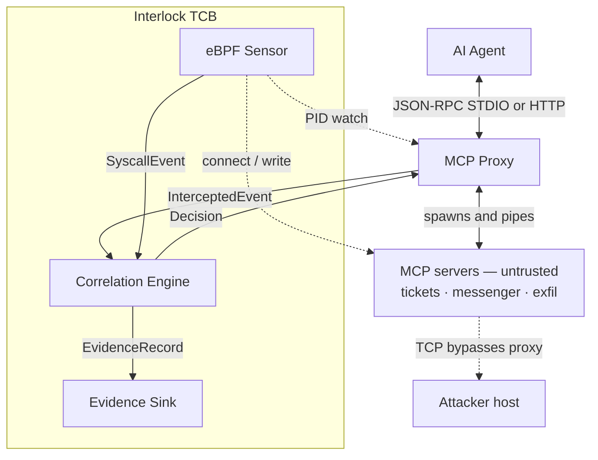

# Interlock — Architecture (v0.2.2 + v0.3 Phase 1/3)

## 0. Reading note

Interlock is a backend/systems tool, not a web app, so the usual buckets map like this:

- **"Frontend / backend boundary"** → the process and **trust** boundaries between the proxy, the kernel sensor, the correlation engine, and the read-only evidence viewer.
- **"State management"** → the per-session **trifecta state machine** plus cross-plane event correlation (§7).
- **"Database schema"** → the **event and evidence data model** (§8). Session state is in-memory; evidence defaults to **JSONL append** (`evidence.jsonl`) by design, with opt-in **SQLite** retention (`evidence.backend: sqlite`, `max_records`).

---

## 1. Component topology



Four components, one binary (plus the kernel probes it loads): the **proxy** (Plane 1), the **eBPF sensor** (Plane 2), the **engine** (owns state and verdicts), and the **evidence sink + viewer** (the only "UI").

---

## 2. Trust boundaries

This is a security tool; boundaries are the design.

- **Untrusted:** MCP server processes (may be poisoned or outright malicious), all tool **results**, fetched web content, and — critically — **the agent's own outputs**, because the agent is the thing being hijacked. Interlock assumes the agent *will* be manipulated and does not trust its intent.
- **Trusted (TCB):** the proxy, engine, eBPF sensor, and config. Interlock **must not become the exfil path itself** — it never forwards a blocked call, holds minimal privilege beyond what eBPF requires, and performs **no network egress of its own** except writing local evidence.
- The agent sits **inside the untrusted zone** from Interlock's perspective. Detection is designed around behavior, not stated intent.

---

## 3. Data flow — life of a tool call

The proxy is **protocol-aware**, not a transparent byte pipe. It terminates `initialize`, `tools/list`, and `ping` internally, synthesizing responses on behalf of all child servers. For `tools/call`, it parses the tool name, resolves it to the owning server via its routing table, and dispatches. This is the enforcement chokepoint.

1. Agent emits a JSON-RPC request (STDIO or HTTP) → **proxy parses the method**. Protocol-level messages (`initialize`, `tools/list`, `ping`, notifications) are handled by the proxy itself — it responds with synthesized results (merged capabilities, merged tool list, etc.) and emits `InterceptedEvent`s for each. These never reach a child server.
2. For `tools/call`: the proxy parses the tool name and arguments from `params`, resolves the tool name to its owning child server via the routing table, and creates an `InterceptedEvent` (direction = agent→server) attributed to that server.
3. Engine runs a **pre-forward `EvaluateRequest`** at this parsed dispatch point — after the proxy knows the tool name, args, and target server. Is this call an `external_sink`, and are the other two legs already lit for this session? If a trip fires → **block** (Variant A): the proxy synthesizes a JSON-RPC error result back to the agent using the same response-synthesis mechanism it uses for `initialize` and `tools/list`. The call **never reaches the server**.
4. Otherwise the proxy **forwards** the raw frame to the resolved child server over its STDIN.
5. Server executes and returns a result on its STDOUT → **proxy intercepts the result frame** → `InterceptedEvent` (direction = server→agent), attributed to the specific server and forwarded to the agent.
6. Engine **ingests the result**: if the tool is a `sensitive_source`, it **registers tainted values** and lights `sensitive_source_touched`; if the tool is **not** a sensitive source and `untrusted_origins.tool_results` is true, it lights `untrusted_content_present` and stores a bounded excerpt for content-binding.
7. In parallel, the **eBPF sensor** streams `SyscallEvent`s from the proxy's PID subtree. A `connect()` from a *server child* to a non-allowlisted destination → `external_sink_invoked` candidate. If the other legs are lit → **trip** (Variant B): emit evidence + **kill the offending child** (containment).
8. On any trip, the engine writes an `EvidenceRecord` to the sink; the viewer renders it.

---

## 4. Plane 1 — the MCP proxy (Go)

**Multi-server, protocol-aware.** In **STDIO mode**, the proxy launches all configured MCP servers as child processes at startup. In **HTTP mode**, each MCP session gets a dedicated backend pool spawned on `initialize` (see §4.1). In both modes the proxy wires stdin/stdout/stderr as pipes, runs the MCP handshake, queries `tools/list`, and builds a **tool name → server** routing table. The agent sees a single MCP endpoint; the proxy presents a merged view of all servers' capabilities.

**Response synthesis.** The proxy handles `initialize`, `tools/list`, and `ping` internally — it assembles responses from the child servers' capabilities and tool definitions without forwarding these protocol-level messages. `tools/list` returns a merged tool list aggregated from all servers. This is the same response-synthesis mechanism that Week 2's enforcement uses to return block errors.

**JSON-RPC framing.** The MCP stdio transport uses newline-delimited JSON-RPC messages (one compact JSON object per line, no embedded newlines). This was verified against the [MCP stdio transport spec](https://modelcontextprotocol.io/specification/draft/basic/transports/stdio) in Week 1: there are **no Content-Length headers** (unlike LSP) — the newline is the sole message delimiter. The frame reader uses `bufio.Scanner` with a 1MB buffer, handles partial reads across `read()` boundaries, tolerates `\r\n` line endings, and skips blank lines.

### 4.1 Transport — Streamable HTTP (v0.2 Phase 1)

Agents can connect via [Streamable HTTP `2025-11-25`](https://modelcontextprotocol.io/specification/2025-11-25/basic/transports/streamable-http) instead of STDIO. **Backend MCP servers remain STDIO child processes** — eBPF PID watching and Variant B containment are unchanged.

**Inspect-then-forward, always.** A blocking firewall cannot stream bytes to the agent before policy runs:

| Direction | Rule |
|---|---|
| Agent → Interlock (POST body) | Full JSON-RPC body parsed before dispatch |
| Interlock → STDIO child | Unchanged — hold-before-forward on `tools/call` before `WriteFrame` |
| STDIO child → Interlock | Full result frame received before `IngestResult` |
| Interlock → Agent (SSE) | Buffer complete JSON-RPC response before writing first SSE `data:` line |

Blocked `tools/call` responses use `Content-Type: application/json` with a synthesized error immediately (no SSE).

**HTTP surface:** `POST /mcp` with `Accept: application/json, text/event-stream`, `MCP-Protocol-Version: 2025-11-25`, and `Mcp-Session-Id` after `initialize`. Optional `Mcp-Method` / `Mcp-Name` headers are validated against the JSON-RPC body (SEP-2243 baseline). `Authorization`, `Cookie`, and similar headers are redacted before any log metadata is emitted.

**TLS posture (Phase 1):** bind `127.0.0.1` only — Interlock sits inside the trust boundary. TLS termination and MITM mode are deferred to a later v0.2 slice.

**Deferred:** HTTP upstream backends (remote MCP server URLs), GET `/mcp` listen streams, TLS termination / MITM mode, and the [2026-07-28 stateless protocol](https://modelcontextprotocol.io/specification/2026-07-28/basic/transports/streamable-http) migration.

### 4.2 Multi-session concurrency (v0.2 Phase 2)

HTTP mode supports **many concurrent MCP sessions**. Each `initialize` spawns an isolated tickets/messenger/exfil backend pool until idle expiry (`sessions.idle_timeout`, default 30m) or `sessions.max_concurrent` (default 32). A `SessionManager` tracks lifecycle; a `PIDRegistry` maps `(pid, start_time)` → `{session_id, server_id}` for eBPF attribution. `IngestSyscall` requires an explicit `SessionID` — no `FirstSessionID` fallback. Unattributed syscalls during PID teardown are audit-logged, not tripped. STDIO mode remains single-session.

**Process lifecycle.** Deterministic startup ordering (spawn all children, initialize each, confirm tools registered, then accept agent traffic); graceful shutdown that drains in-flight frames; crash handling that surfaces a clean error to the agent rather than hanging; process-group isolation (`Setpgid`) so children can be killed cleanly; and **kill-on-detect** — the containment primitive Plane 2 uses for Variant B.

**Enforcement (hold-before-forward at the `tools/call` dispatch point).** Enforcement hooks at the specific point where the proxy has parsed a `tools/call` request, extracted the tool name and arguments, and resolved the target server — not at a generic frame boundary. The engine's `EvaluateRequest` runs here. On `Allow`, the raw frame is forwarded to the resolved child. On block, the proxy **never forwards** and instead synthesizes a JSON-RPC error (`"call blocked by Interlock: <reason>"`) using the same response-synthesis path it already uses for protocol messages. The agent gets a clean, legible failure.

---

## 5. Plane 2 — the eBPF sensor (kernel)

**Attachment.** Probes are scoped to the proxy's **process subtree** — the proxy PID plus every server child PID. Userspace maintains the live PID set and pushes it to a **BPF hash map** (`BPF_MAP_TYPE_HASH`) so the probe checks membership cheaply in-kernel before emitting events.

**Probe: `connect()` + `write()` + `sendto()` + `openat()` (Variant B).**
- Tracepoints: `sys_enter_connect`, `sys_enter_write`, `sys_enter_sendto`, `sys_enter_openat`.
- Connect: destination IP/port from `sockaddr_in`, PID, TID, and comm (IPv4 only).
- Write: first **N** bytes via `bpf_probe_read_user` (fd ≥ 3; compiled `PAYLOAD_MAX=1024`, runtime `ebpf.payload_capture_bytes` default **512**); correlated in userspace to a recent non-allowlisted connect/`sendto` from the same PID.
- Sendto: **self-contained** IPv4 dest + first-N payload; allowlist on dest IP; port **53** tagged as `dns` in userspace. No prior `connect()` required.
- Openat: pathname (≤128 bytes); userspace matches `sensitive_paths` prefixes (empty list = ignore).
- Events pushed to a **ring buffer** (`BPF_MAP_TYPE_RINGBUF`, 256KB). Reserve failures increment a `drop_count` map surfaced via `Sensor.DropCount()`.
- Compiled from BPF C via `bpf2go` (cilium/ebpf), loaded by Go at runtime. CO-RE via BTF at `/sys/kernel/btf/vmlinux`.
- **Still deferred:** IPv6, `sendmsg`/`writev`. Depth-3 nests closed by sink-path recursive decoder. **Out of scope:** DoH/DoT (network-layer DNS controls).

**Detect-only at the kernel.** The sensor **observes**; it does not block at the kernel. Containment happens in **userspace via kill-on-detect**, with a **~100 ms deferred kill window** after connect/`sendto` SUSPICIOUS so a correlated write can land for payload overlap. `sendto`/`write` EXFIL and `openat` trips kill promptly. Kernel-level *blocking* (LSM/KRSI) is deferred to v0.3. **Honest consequence:** for Variant B the first packet (and possibly a short write) may have already left when kill fires — Interlock **severs the channel and kills the process before it can exfiltrate further**, rather than perfectly preventing the first byte. Variant A (proxy) is true prevention; Variant B (eBPF) is detection + containment.

**Verdicts.** Connect-only or DNS/`sendto` without overlap → `SUSPICIOUS` at 0.60. Write/`sendto` excerpt overlapping a tainted secret → `EXFIL` at 0.95 with `value_overlap.where_found: egress payload`. Openat of a sensitive path → `SUSPICIOUS` only (open ≠ proven exfil). Writes without a recent suspicious connect/`sendto` are ignored (noise filter).

**Transport to userspace.** Ring buffer → Go decoder in `internal/ebpf/loader.go` → `model.SyscallEvent` structs → engine's `IngestSyscall` method.

**Allowlist check.** The sensor checks each `connect()`/`sendto()` destination against the config's `egress_allowlist`. Allowlisted IPs are silently dropped; non-allowlisted destinations light the `external_sink_invoked` leg and arm write-payload correlation for that PID.

**False-positive surface (stated plainly).** Connect-only Variant B no longer hard-kills on `SUSPICIOUS`: after ROADMAP §1, hard contain is EXFIL-only (payload overlap). Soft `SUSPICIOUS` requires AllLit plus content-bind and uses `detected_only`.

**Prototype-first.** The `connect()` probe was validated with a `bpftrace` one-liner before writing compiled eBPF. This de-risked the hardest part of the week.

---

## 6. The correlation + policy engine

Consumes `InterceptedEvent` (Plane 1) and `SyscallEvent` (Plane 2); **owns `SessionState`**; emits `Decision`s (→ proxy) and `EvidenceRecord`s (→ sink).

**Correlation (syscall → session).** eBPF events carry a PID. The proxy maintains a `PIDRegistry` mapping `(pid, start_time)` → `{session_id, server_id}` for each per-session backend child. The sensor resolves `SessionID` before calling `IngestSyscall`. HTTP mode spawns an isolated server pool per MCP session; STDIO mode runs a single session.

**Time alignment.** All events carry a monotonic timestamp (`ts_mono_ns`) from a shared reference. Syscall events are joined to recent proxy events within a **recency window** so a `connect()` can be attributed to the sensitive read that preceded it.

---

## 7. State management — the trifecta state machine

One state machine **per session**.

**The three legs** (each is a `Leg`: lit-flag + the event that lit it + a human detail):

- `sensitive_source_touched` — set when a tool tagged `sensitive_source` returns data.
- `untrusted_content_present` — set when content enters context from an attacker-controllable origin. Lights on **non-`sensitive_source`** tool results when `untrusted_origins.tool_results` is true; stores a bounded excerpt for content-binding. Does **not** light on sensitive-source results or sensor `openat`.
- `external_sink_invoked` — set when a tool tagged `external_sink` is called, **or** an eBPF `connect()`/egress to a non-allowlisted destination fires.

**Tainted values.** When a `sensitive_source` returns data, the engine extracts candidate secrets and stores them as `TaintedValue`s — **hashed + masked, never raw** (§12). At registration, each value gets a fixed set of **canonical encodings** (literal, base64, hex, URL-encoding, reversal) held in memory only.

**Value overlap.** At sink time, `CheckOverlap` scans sink args for any tainted value in any canonical form, then (if needed) **same-call JSON string reassembly** (concat of string leaves). Forms: literal, base64, hex, URL-encoding, reversal, closed depth-2 nests (`base64_hex`, `hex_base64`, `base64_url`, `base64_reversed`), and `gzip_base64`. On still-miss, a **bounded recursive decoder** (base64 then hex, depth ≤ 3) unwraps JSON string leaves / payloads and rematches against single-layer forms — `match_form` records `decoded_*`. **Cross-call / paginated abutting splits** are closed by the session **fragment buffer** (reassembly-first taint registration). Still out of scope: depth-4+ nests, other compressors — each has a skip / KnownGap. `RedactJSON` scrubs all variant strings from logs.

**Content-binding.** `CheckContentBind` requires a shared contiguous substring (default ≥ 16 bytes; `trifecta.content_bind_min_len`) between stored untrusted excerpts and the sink args/payload before `SUSPICIOUS` can fire. Separate from EXFIL overlap. Soft `SUSPICIOUS` is evidence + `allowed_monitor` / `detected_only` — never hard block/kill.

Operators running fetch-heavy agents (web fetch → quote/summarize into a sink) will see soft-SUSPICIOUS noise whenever a long product blurb or doc excerpt is echoed outbound. That is correct system behavior for the current bind threshold, not a sticky-leg false block. To reduce operator noise: raise `trifecta.content_bind_min_len`, or avoid treating high-chatter servers as untrusted (leave `untrusted_origins.tool_results` false for those paths / omit them from untrusted lighting). Do **not** widen hard enforcement to cover this class.

**Extraction boundary.** `extractResultText` prefers MCP `content[].text`, then walks other JSON string leaves (bounded depth/bytes), skipping the already-handled `content` key so paginated halves stay abutting for the fragment buffer. Nested metadata secrets are tainted; the benign twin keeps an unrelated sink so EXFIL FP stays 0%.

**Tool tagging / intra-server writes.** `EvaluateRequest` only gates tools tagged `external_sink`. An untagged write-shaped tool on a `sensitive_source` server (e.g. `internal_note` with an empty `tool_tags` override) is invisible to the engine — pinned as `malicious_gap_untagged_tool_on_sensitive_server`. **Current stance:** operators must explicitly tag every tool that can egress or write data (`external_sink`), regardless of which server hosts it. A future hardening (not shipped) is optional sink-suspicion inheritance for write-shaped tools on sensitive servers unless allowlisted — see [`ROADMAP.md`](ROADMAP.md) Next build order.

**Evaluation — verdict and action are separate dimensions.** The machine evaluates the moment a sink fires. **Verdict** describes what was concluded (the detection result); **Action** describes what was done about it (the enforcement response). This separation is load-bearing: Variant A can *prevent* (hold-before-forward), Variant B can only *contain* (kill after the first packet), and monitor mode *allows* — all three are valid actions for the same verdict.

| Condition at sink time | Verdict | Confidence |
|---|---|---|
| Tainted value appears in the sink's args/payload (`CheckOverlap`) | `EXFIL` | 0.95 |
| All three legs lit **and** untrusted↔sink content-bind, no value overlap | `SUSPICIOUS` | 0.60 |
| Otherwise | — (no trip) | — |

| Action | When | Effect |
|---|---|---|
| `prevented` | Variant A, block mode, **EXFIL only** | Call never forwarded; synthesized JSON-RPC error |
| `allowed_monitor` | Monitor mode (any verdict), **or** Variant A `SUSPICIOUS` in block mode | Call goes through; evidence logged |
| `contained_by_kill` | Variant B (eBPF), **EXFIL only** | Offending child killed; first packet may escape |
| `detected_only` | Variant B, `SUSPICIOUS` | Detected and logged; no kill |

**Reset / decay.** Legs are session-scoped. Configurable `trifecta.leg_ttl` (default 30m) and `trifecta.decay_after_calls` (default 32) dim sticky legs so a poisoned session does not forever treat every sink as suspicious. Tainted values are **not** cleared on leg decay — a late sink that still carries a secret can still reach EXFIL.

**Detection scope.** Mechanisms here; attack classes in/out of scope (including intentional **semantic / paraphrase** EXFIL gap) live in [`detection_boundary.md`](detection_boundary.md). Measured rates: [`fp_corpus.md`](fp_corpus.md).

**Concurrency.** Sessions are isolated; state is per-`session_id`. HTTP mode runs many concurrent sessions (§4.2); STDIO mode exercises one session. Race coverage: `go test -race` on `./internal/proxy/...` and `./internal/engine/...` in CI.

**Monitor / dry-run mode.** `enforcement: monitor` runs the full machine and emits evidence **without** blocking or killing — for tuning and for the "before" half of the demo.

---

## 8. Data model ("schemas")

The load-bearing contract. Getting this right **now** is what lets Weeks 2–3 plug in without a rewrite.

```go
// ---- Plane 1: proxy ----
type Direction string
const (
    AgentToServer Direction = "agent_to_server" // request
    ServerToAgent Direction = "server_to_agent" // response
)

type InterceptedEvent struct {
    SessionID   string          `json:"session_id"`
    Seq         uint64          `json:"seq"`            // monotonic per session
    TSWall      time.Time       `json:"ts_wall"`
    TSMono      int64           `json:"ts_mono_ns"`
    Direction   Direction       `json:"direction"`
    Method      string          `json:"jsonrpc_method"` // "tools/call", "tools/list", ...
    ToolName    string          `json:"tool_name,omitempty"`
    ToolArgs    json.RawMessage `json:"tool_args,omitempty"`  // requests
    Result      json.RawMessage `json:"result,omitempty"`     // responses
    ServerID    string          `json:"server_id"`
    ServerPID   int             `json:"server_pid"`     // key for eBPF correlation
    Tags        []string        `json:"tags,omitempty"` // ["sensitive_source"] | ["external_sink"]
    Decision    string          `json:"decision"`       // forwarded | blocked | pending
    BlockReason string          `json:"block_reason,omitempty"`
}

// ---- Plane 2: kernel ----

// PodContext identifies the Kubernetes pod that owns a monitored process.
// Present on sensor-mode (v0.3 Phase 1) evidence; omitted for proxy-local demos.
type PodContext struct {
    Namespace string `json:"namespace"`
    PodName   string `json:"pod_name"`
    PodUID    string `json:"pod_uid"`
    NodeName  string `json:"node_name,omitempty"`
}

type SyscallEvent struct {
    TSMono         int64       `json:"ts_mono_ns"`
    PID            int         `json:"pid"`
    TID            int         `json:"tid"`
    Comm           string      `json:"comm"`
    Syscall        string      `json:"syscall"`      // connect | sendto | write | openat | dns
    DestIP         string      `json:"dest_ip,omitempty"`
    DestPort       int         `json:"dest_port,omitempty"`
    Allowlisted    bool        `json:"allowlisted,omitempty"`
    Path           string      `json:"path,omitempty"`            // openat
    PayloadExcerpt string      `json:"payload_excerpt,omitempty"` // redacted first-N-bytes
    SessionID      string      `json:"session_id,omitempty"`      // resolved via PID map, or "k8s:<podUID>" in sensor mode
    CgroupID       uint64      `json:"cgroup_id,omitempty"`       // sensor mode: cgroup → container → pod lookup key
    Pod            *PodContext `json:"pod_context,omitempty"`     // sensor mode only
    FileContents   string      `json:"-"`                         // sensor-mode openat taint seed via /proc/<pid>/root; never persisted
}

// ---- Engine state ----
type Leg struct {
    Lit        bool   `json:"lit"`
    TriggerSeq uint64 `json:"trigger_seq,omitempty"` // event that lit it
    Detail     string `json:"detail,omitempty"`
}
type TrifectaLegs struct {
    SensitiveSourceTouched  Leg `json:"sensitive_source_touched"`
    UntrustedContentPresent Leg `json:"untrusted_content_present"`
    ExternalSinkInvoked     Leg `json:"external_sink_invoked"`
}

type TaintedValue struct {
    Value        string `json:"-"`       // NEVER serialized raw
    Hash         string `json:"hash"`    // sha256(value)
    Preview      string `json:"preview"` // masked, e.g. "sk-...a9f2"
    Source       string `json:"source"`  // server/tool that produced it
    Seq          uint64 `json:"seq"`     // event that introduced it
    RegisteredAt int64  `json:"registered_at_ns"`
}

type Status string
const (
    Monitoring Status = "monitoring"
    Tripped    Status = "tripped"
    Terminated Status = "terminated"
)

type SessionState struct {
    SessionID    string         `json:"session_id"`
    Status       Status         `json:"status"`
    Legs         TrifectaLegs   `json:"legs"`
    Tainted      []TaintedValue `json:"tainted_values"`
    Confidence   float64        `json:"confidence"`
    Timeline     []uint64       `json:"timeline"` // ordered event seqs
    CreatedAt    int64          `json:"created_at_ns"`
    LastActivity int64          `json:"last_activity_ns"`
}

// ---- Evidence (feeds the viewer) ----
// Verdict = what was concluded (detection). Action = what was done (enforcement).
type Verdict string
const (
    VerdictExfil      Verdict = "EXFIL"      // high confidence: all legs + value overlap
    VerdictSuspicious Verdict = "SUSPICIOUS"  // lower confidence: all legs, no overlap
)
type Action string
const (
    ActionPrevented    Action = "prevented"        // Variant A block: call never forwarded
    ActionAllowed      Action = "allowed_monitor"   // monitor mode: call went through
    ActionContained    Action = "contained_by_kill" // Variant B: child killed (Week 3)
    ActionDetectedOnly Action = "detected_only"     // detected, no enforcement (kill too aggressive)
)
type Variant string
const (
    VariantA Variant = "A_chained_tool"   // caught by proxy
    VariantB Variant = "B_server_channel"  // caught by eBPF
)

type EvidenceRecord struct {
    SessionID    string         `json:"session_id"`
    TripTS       int64          `json:"trip_ts_ns"`
    Verdict      Verdict        `json:"verdict"`
    Action       Action         `json:"action"`                // what enforcement took
    Variant      Variant        `json:"variant"`
    Confidence   float64        `json:"confidence"`
    Legs         TrifectaLegs   `json:"legs"`
    SinkCall     any            `json:"sink_call"`             // the tool call or syscall that tripped
    ValueOverlap *OverlapHit    `json:"value_overlap,omitempty"`
    Timeline     []TimelineItem `json:"timeline"`              // full ordered story
    Pod          *PodContext    `json:"pod_context,omitempty"` // sensor mode (v0.3 Phase 1) only
}

type OverlapHit struct {
    TaintedHash string `json:"tainted_hash"`
    Preview     string `json:"preview"`
    WhereFound  string `json:"where_found"`         // "sink args" | "egress payload"
    MatchForm   string `json:"match_form,omitempty"` // literal | base64 | hex | url_encoded | reversed | ...
}
// TimelineSeq is an engine-assigned causal ordering — sort on this, not
// ts_mono_ns, because proxy and kernel clocks use different references.
type TimelineItem struct {
    TimelineSeq int    `json:"timeline_seq"`
    TSMono      int64  `json:"ts_mono_ns"`
    Kind        string `json:"kind"`   // intercepted | syscall
    Label       string `json:"label"`  // human line for the viewer
    Ref         uint64 `json:"ref,omitempty"`
}
```

---

## 9. Configuration model

A single `interlock.yaml` declares servers, tool tags, the egress allowlist, and enforcement mode.

```yaml
enforcement: block          # block | monitor
egress_allowlist:           # anything NOT here is treated as an external sink at the kernel
  - 127.0.0.1
  - api.anthropic.com
servers:
  - id: tickets
    command: ./servers/tickets/tickets
    provides_tags: [sensitive_source]
  - id: messenger
    command: ./servers/messenger/messenger
    provides_tags: [external_sink]
tool_tags:                  # per-tool overrides (authoritative)
  read_ticket: [sensitive_source]
  send_message: [external_sink]
  http_post:   [external_sink]
untrusted_origins:
  tool_results: true        # v0.1 default: all results untrusted
  web_fetches:  true
```

---

## 10. The evidence viewer ("frontend")

A **self-contained local HTML file** that reads one `EvidenceRecord` JSON and renders the timeline: a horizontal time axis, the three legs lighting up in sequence, the tainted-value highlight where it surfaces in the sink, and a verdict badge (`EXFIL`/`SUSPICIOUS`) plus action label (`prevented`/`allowed_monitor`/`contained_by_kill`). **Read-only, no framework, no server.** "State" on the frontend is just the single evidence file — this is the money-shot visual, not an app.

---

## 11. Module boundaries / interfaces (Go)

Interfaces so components stay swappable and testable, and so the eBPF plane slots into the same engine the proxy already feeds.

```go
// Both proxy and eBPF sensor implement this.
type EventSource interface {
    Events() <-chan any   // yields InterceptedEvent or SyscallEvent
    Close() error
}

type Decision struct {
    Allow    bool
    Verdict  Verdict
    Action   Action
    Reason   string
    Evidence *EvidenceRecord // set when a trip fires
}

type PolicyEngine interface {
    EvaluateRequest(ev InterceptedEvent) Decision // pre-forward gate (Variant A)
    Ingest(ev any)                                // results + syscalls; may trip (Variant B)
}

type Enforcer interface {
    BlockCall(sessionID, reason string)  // synthesize JSON-RPC error to agent
    KillProcess(pid int, reason string)  // containment for Variant B
}

type EvidenceSink interface {
    Emit(rec EvidenceRecord) error       // JSONL append + trigger viewer
}

type SessionStore interface {
    Get(sessionID string) *SessionState
    Upsert(s *SessionState)
}
```

---

## 12. Security of Interlock itself

Full TCB threat model (blind sensor, poison bridge, fail-open, misattribution, evidence tamper, bypass channels): [`threat_model.md`](threat_model.md). Provenance: [`reproducible_builds.md`](reproducible_builds.md).

- **Runs privileged** (loading eBPF, managing child processes). Prefer the capabilities DaemonSet; residual `SYS_ADMIN` documented in the threat model / PRIVILEGE.md. Drop further capabilities post-attach remains iterative.
- **Never leaks the secrets it's protecting.** Tainted values are stored **hashed + masked** (`sk-...a9f2`), never raw. The value-overlap check compares raw values in memory only; evidence stores only the masked preview. All output files (`evidence.jsonl`, `evidence.json`, `events.jsonl`) are scrubbed by `RedactJSON` before writing — any known tainted value is replaced with its masked preview. Interlock writing the token in plaintext to a log would make the tool *itself* an exfil path — forbidden.
- **Fail-open vs. fail-closed.** Current default is **fail-open with loud `[SECURITY]` warnings** on stderr. This is a conscious tradeoff; production `fail_closed` is ROADMAP §5. The `[SECURITY]` prefix fires in scenarios including: (1) engine not configured, (2) engine panics mid-evaluation, (3) evidence sink write failure, (4) missing tool tags, (5) **unattributed eBPF syscalls**, (6) **event log backpressure drops**, (7) **eBPF ring-buffer reserve failures**. Deployers should monitor for `[SECURITY]` in stderr output and ringbuf drop metrics.

**Evidence persistence (v0.2 Phase 4).** **Intentional default:** JSONL append (`evidence.jsonl`) + standalone `evidence.json` for the viewer — demo/dev-friendly, no extra deps. **Opt-in retention:** SQLite (`evidence.backend: sqlite`) with `max_records` — survives restart, prunes oldest records. Bounded growth is available when operators enable SQLite; leaving JSONL as default is a posture choice, not an unfinished gap. See [`performance.md`](performance.md) for engine microbenchmarks and end-to-end HTTP overhead (v0.2.1).

**Event log backpressure.** `logging.backpressure: block` (default) — synchronous writes, caller blocks. `drop` — bounded queue; overflow increments `DroppedEvents` and logs `[SECURITY]` at shutdown.

**eBPF ring-buffer drops.** When `bpf_ringbuf_reserve` fails in [`connect.c`](../internal/ebpf/bpf/connect.c), the kernel increments `drop_count`. Userspace reads via `Sensor.DropCount()` at shutdown.

---

## 13. Known gaps and deferred work

**Priority tiers** (will cover / eventually / never): [`SUMMARY.md`](SUMMARY.md).

**Still deferred (see [`ROADMAP.md`](ROADMAP.md) and SUMMARY tiers):**

- **eBPF remaining gaps** — IPv6, `sendmsg`/`writev` (write+sendto+openat+DNS-via-53 shipped)
- **Full dataflow taint** — same-call reassembly + depth-2 + gzip_base64 + cross-call fragment buffer + depth-3 recursive decoder shipped; other compressors / depth-4+ still deferred
- **Operability layer** — metrics/health + trip webhook + OCSF SIEM **met** (v0.3 Phase 3); systemd + SIGHUP cleanup shipped ([`deploy/systemd/`](../deploy/systemd/))
- **Kernel-level blocking** (LSM/KRSI) — prevent before first packet leaves (v0.3 Phase 2; demand-gated, not a hard exit gate)
- **HTTP upstream backends**, TLS termination / MITM, GET `/mcp` listen streams
- **Dashboard / query API** — cross-session evidence search (`TestEvidenceStore_CrossSessionQuery_KnownGap`)
- **Sensor↔proxy taint bridge** — **met**: Unix NDJSON `/var/run/interlock/taint.sock`; capabilities DaemonSet + proxy can EXFIL without privileged `/proc` seed. openat seed remains privileged-demo fallback.

**Out of scope:** **DoH/DoT** — encrypted DNS needs TLS interception or shifting resolver allowlists; mitigate with network-layer DNS controls, not inside Interlock.

**Shipped (v0.2 + post-v0.2 + v0.3 Phase 1):** Streamable HTTP, multi-session, encoding-aware + bounded overlap expansion, write/sendto/openat/DNS probes, async evidence, JSONL default (intentional) with opt-in SQLite, published overhead, **sensor-only Kubernetes DaemonSet** (`--mode=sensor`, PID→pod attribution, `deploy/k8s/`). Current summary: [`SUMMARY.md`](SUMMARY.md).

### Sensor-only DaemonSet (v0.3 Phase 1)

`--mode=sensor --ebpf` runs without the MCP proxy. A node-local watcher (`internal/k8s`) lists pods with label `interlock.io/monitor=true` on `NODE_NAME`, maps host PIDs via `/proc/<pid>/cgroup` → container ID → pod, and feeds `Sensor.AddPIDs`. Evidence includes `pod_context`.

`IngestSyscallSensor`: sensitive `openat` seeds legs + taint (via `/proc/<pid>/root` file read; no kill); egress `connect`/`write`/`sendto`/`dns` contain. Payload overlap → **EXFIL 0.95** with redacted `payload_excerpt`. Without taint contents, egress stays SUSPICIOUS. Untrusted leg detail: *monitored agent pod accessed sensitive path; no MCP untrusted-content plane*. Privilege story: [`deploy/k8s/PRIVILEGE.md`](../deploy/k8s/PRIVILEGE.md); demo: [`deploy/k8s/README.md`](../deploy/k8s/README.md).

**Managed-cluster note (EKS 2026-07-12):** capabilities DaemonSet loads probes and observes cross-pod `connect`/`write`; `/proc/<pid>/root` seed was permission-denied on AL2023/containerd. Privileged DaemonSet completed seed → EXFIL → kill. **Production EXFIL without privileged root reads:** enable `taint_bridge` (proxy → Unix socket → `RegisterRemoteTaint`).

---

## 14. Operability layer (v0.3 Phase 3)

Four packages that decide whether a team keeps Interlock running in production. All are optional — disabled unless configured — and all fan out from the same point: after an `EvidenceRecord` is persisted by `AsyncEvidenceSink`.

```go
// engine.MultiEmitObserver — fan-out to every configured observer.
type EvidenceEmitObserver interface {
    OnEvidenceEmitted(rec model.EvidenceRecord)
}
type MultiEmitObserver []EvidenceEmitObserver // metrics, webhook, siem — nil entries skipped
```

### 14.1 Metrics and health (`internal/observability`)

Starts an HTTP server on `observability.listen` (disabled when empty) serving:

| Endpoint | Behavior |
|---|---|
| `metrics_path` (default `/metrics`) | Standard Prometheus exposition via `promhttp.Handler()` |
| `health_path` (default `/healthz`) | `200 ok` when ready, `503` otherwise |

Metrics: `interlock_up` (gauge), `interlock_detections_total{verdict,variant,action}` (counter, incremented on every evidence emit), `interlock_evidence_dropped_total` / `interlock_events_dropped_total` (async backpressure drops), `interlock_ebpf_ringbuf_drops_total` / `interlock_watched_pids` / `interlock_watched_cgroups` (polled from the live sensor every 5s via `observability.PollRuntime`), `interlock_alert_deliveries_total{kind,result}` (webhook/SIEM delivery outcomes, `kind` ∈ `webhook|siem`, `result` ∈ `ok|error|skipped`).

The DaemonSet wires `/healthz` as the liveness/readiness probe and exposes `/metrics` via a headless Service for Prometheus scrape (`deploy/k8s/service-metrics.yaml`).

### 14.2 Trip webhooks (`internal/alerting`)

`alerting.webhook` fires an async HTTP POST whenever an evidence record's verdict meets `min_verdict` (default `SUSPICIOUS`). Three formats:

| Format | Body |
|---|---|
| `generic` (default) | Compact JSON: session/verdict/action/variant/confidence/legs/sink_call/value_overlap |
| `slack` | Slack Incoming Webhook `{"text": ...}` |
| `pagerduty` | Events API v2 `trigger` with `routing_key`, `dedup_key`, `payload.summary/severity/source/custom_details` |

Delivery is bounded-concurrency and non-blocking relative to the evidence hot path; a full backlog drops the alert (counted, never blocks a trip). `WebhookNotifier.Close()` drains in-flight deliveries.

### 14.3 SIEM export (`internal/siem`)

`siem` maps an `EvidenceRecord` to an **OCSF 1.3 Detection Finding** (`class_uid=2004`, `category_uid=2`, `activity_id=1`) and writes it to a JSONL file (`siem.path`) and/or POSTs it to `siem.url`. Severity: `EXFIL` → `5/Critical`, `SUSPICIOUS` → `3/Medium`. Interlock-specific fields (session_id, verdict, action, variant, pod_context, sink_call, value_overlap) live under OCSF's `unmapped`. CEF export is not implemented. Same `min_verdict` filtering and async delivery semantics as webhooks.

### 14.4 SIGHUP hot-reload (`internal/reload`)

`cmd/interlock/main.go` installs a `SIGHUP` handler in both proxy and sensor modes. On signal, it re-parses the config file and calls `reload.Runtime.ApplyReloadable`, which live-swaps:

- `egress_allowlist`, `sensitive_paths` — via `Sensor.UpdateAllowlist` / `UpdateSensitivePaths` (sensor/eBPF mode only; guarded by a `sync.RWMutex` so the syscall handlers never race the reload)
- `alerting.webhook`, `siem` — new notifier/exporter constructed, wired into a fresh `MultiEmitObserver`, then the *old* instance's `Close()` is called after the swap so in-flight deliveries finish
- The async evidence sink's emit observer set

`reload.DiffNonReloadable` flags fields that changed but are **not** applied live — `enforcement`, `transport`, `observability.listen`/`metrics_path`/`health_path`, `evidence` backend/path, and a change in `servers` count — logged as "restart required" warnings. Invalid YAML or a failed validation on reload is logged and the **previous** config is kept; Interlock never runs on a half-applied config.

### 14.5 systemd units (`deploy/systemd/`)

For bare-metal/VM hosts (Kubernetes remains the primary deploy path). `interlock-sensor.service` and `interlock-proxy.service` wrap the same binary and flags as the DaemonSet/local demo; `ExecReload=/bin/kill -HUP $MAINPID` maps `systemctl reload` to the hot-reload path above.
