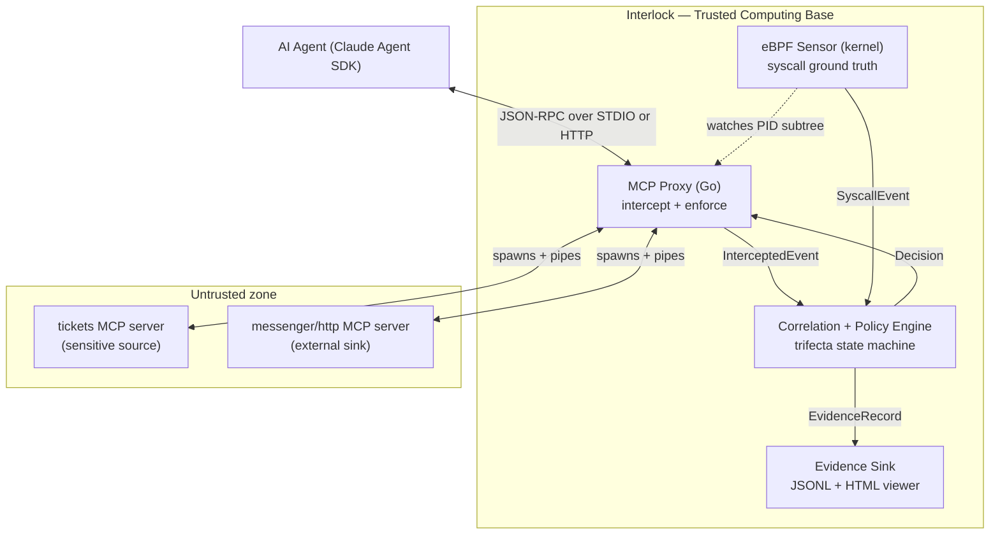

# Interlock — Architecture (v0.1)

## 0. Reading note

Interlock is a backend/systems tool, not a web app, so the usual buckets map like this:

- **"Frontend / backend boundary"** → the process and **trust** boundaries between the proxy, the kernel sensor, the correlation engine, and the read-only evidence viewer.
- **"State management"** → the per-session **trifecta state machine** plus cross-plane event correlation (§7).
- **"Database schema"** → the **event and evidence data model** (§8). v0.1 persists to memory + a JSONL evidence log; there is no external database.

---

## 1. Component topology



Four components, one binary (plus the kernel probes it loads): the **proxy** (Plane 1), the **eBPF sensor** (Plane 2), the **engine** (owns state and verdicts), and the **evidence sink + viewer** (the only "UI").

---

## 2. Trust boundaries

This is a security tool; boundaries are the design.

- **Untrusted:** MCP server processes (may be poisoned or outright malicious), all tool **results**, fetched web content, and — critically — **the agent's own outputs**, because the agent is the thing being hijacked. Interlock assumes the agent *will* be manipulated and does not trust its intent.
- **Trusted (TCB):** the proxy, engine, eBPF sensor, and config. Interlock **must not become the exfil path itself** — it never forwards a blocked call, holds minimal privilege beyond what eBPF requires, and performs **no network egress of its own** except writing local evidence.
- The agent sits **inside the untrusted zone** from Interlock's perspective. Detection is designed around behavior, not stated intent.

---

## 3. Data flow — life of a tool call

The proxy is **protocol-aware**, not a transparent byte pipe. It terminates `initialize`, `tools/list`, and `ping` internally, synthesizing responses on behalf of all child servers. For `tools/call`, it parses the tool name, resolves it to the owning server via its routing table, and dispatches. This is the enforcement chokepoint.

1. Agent emits a JSON-RPC request over STDIN → **proxy parses the method**. Protocol-level messages (`initialize`, `tools/list`, `ping`, notifications) are handled by the proxy itself — it responds with synthesized results (merged capabilities, merged tool list, etc.) and emits `InterceptedEvent`s for each. These never reach a child server.
2. For `tools/call`: the proxy parses the tool name and arguments from `params`, resolves the tool name to its owning child server via the routing table, and creates an `InterceptedEvent` (direction = agent→server) attributed to that server.
3. Engine runs a **pre-forward `EvaluateRequest`** at this parsed dispatch point — after the proxy knows the tool name, args, and target server. Is this call an `external_sink`, and are the other two legs already lit for this session? If a trip fires → **block** (Variant A): the proxy synthesizes a JSON-RPC error result back to the agent using the same response-synthesis mechanism it uses for `initialize` and `tools/list`. The call **never reaches the server**.
4. Otherwise the proxy **forwards** the raw frame to the resolved child server over its STDIN.
5. Server executes and returns a result on its STDOUT → **proxy intercepts the result frame** → `InterceptedEvent` (direction = server→agent), attributed to the specific server and forwarded to the agent.
6. Engine **ingests the result**: if the tool is a `sensitive_source`, it **registers tainted values** and lights `sensitive_source_touched`; because all tool results are untrusted in v0.1, it also lights `untrusted_content_present`.
7. In parallel, the **eBPF sensor** streams `SyscallEvent`s from the proxy's PID subtree. A `connect()` from a *server child* to a non-allowlisted destination → `external_sink_invoked` candidate. If the other legs are lit → **trip** (Variant B): emit evidence + **kill the offending child** (containment).
8. On any trip, the engine writes an `EvidenceRecord` to the sink; the viewer renders it.

---

## 4. Plane 1 — the MCP proxy (Go)

**Multi-server, protocol-aware.** The proxy launches **all** configured MCP servers as child processes at startup, wiring each server's stdin/stdout/stderr as pipes. During startup it initializes each server via the MCP handshake (`initialize` + `notifications/initialized`), queries `tools/list` from each, and builds a **tool name → server** routing table. The agent sees a single MCP endpoint; the proxy presents a merged view of all servers' capabilities.

**Response synthesis.** The proxy handles `initialize`, `tools/list`, and `ping` internally — it assembles responses from the child servers' capabilities and tool definitions without forwarding these protocol-level messages. `tools/list` returns a merged tool list aggregated from all servers. This is the same response-synthesis mechanism that Week 2's enforcement uses to return block errors.

**JSON-RPC framing.** The MCP stdio transport uses newline-delimited JSON-RPC messages (one compact JSON object per line, no embedded newlines). This was verified against the [MCP stdio transport spec](https://modelcontextprotocol.io/specification/draft/basic/transports/stdio) in Week 1: there are **no Content-Length headers** (unlike LSP) — the newline is the sole message delimiter. The frame reader uses `bufio.Scanner` with a 1MB buffer, handles partial reads across `read()` boundaries, tolerates `\r\n` line endings, and skips blank lines.

### 4.1 Transport — Streamable HTTP (v0.2 Phase 1)

Agents can connect via [Streamable HTTP `2025-11-25`](https://modelcontextprotocol.io/specification/2025-11-25/basic/transports/streamable-http) instead of STDIO. **Backend MCP servers remain STDIO child processes** — eBPF PID watching and Variant B containment are unchanged.

**Inspect-then-forward, always.** A blocking firewall cannot stream bytes to the agent before policy runs:

| Direction | Rule |
|---|---|
| Agent → Interlock (POST body) | Full JSON-RPC body parsed before dispatch |
| Interlock → STDIO child | Unchanged — hold-before-forward on `tools/call` before `WriteFrame` |
| STDIO child → Interlock | Full result frame received before `IngestResult` |
| Interlock → Agent (SSE) | Buffer complete JSON-RPC response before writing first SSE `data:` line |

Blocked `tools/call` responses use `Content-Type: application/json` with a synthesized error immediately (no SSE).

**HTTP surface:** `POST /mcp` with `Accept: application/json, text/event-stream`, `MCP-Protocol-Version: 2025-11-25`, and `Mcp-Session-Id` after `initialize`. Optional `Mcp-Method` / `Mcp-Name` headers are validated against the JSON-RPC body (SEP-2243 baseline). `Authorization`, `Cookie`, and similar headers are redacted before any log metadata is emitted.

**TLS posture (Phase 1):** bind `127.0.0.1` only — Interlock sits inside the trust boundary. TLS termination and MITM mode are deferred to a later v0.2 slice.

**Deferred:** HTTP upstream backends (remote MCP server URLs), multi-session concurrent HTTP clients (Phase 2, #5), GET `/mcp` listen streams, and the [2026-07-28 stateless protocol](https://modelcontextprotocol.io/specification/2026-07-28/basic/transports/streamable-http) migration.

**Process lifecycle.** Deterministic startup ordering (spawn all children, initialize each, confirm tools registered, then accept agent traffic); graceful shutdown that drains in-flight frames; crash handling that surfaces a clean error to the agent rather than hanging; process-group isolation (`Setpgid`) so children can be killed cleanly; and **kill-on-detect** — the containment primitive Plane 2 uses for Variant B.

**Enforcement (hold-before-forward at the `tools/call` dispatch point).** Enforcement hooks at the specific point where the proxy has parsed a `tools/call` request, extracted the tool name and arguments, and resolved the target server — not at a generic frame boundary. The engine's `EvaluateRequest` runs here. On `Allow`, the raw frame is forwarded to the resolved child. On block, the proxy **never forwards** and instead synthesizes a JSON-RPC error (`"call blocked by Interlock: <reason>"`) using the same response-synthesis path it already uses for protocol messages. The agent gets a clean, legible failure.

---

## 5. Plane 2 — the eBPF sensor (kernel)

**Attachment.** Probes are scoped to the proxy's **process subtree** — the proxy PID plus every server child PID. Userspace maintains the live PID set and pushes it to a **BPF hash map** (`BPF_MAP_TYPE_HASH`) so the probe checks membership cheaply in-kernel before emitting events.

**Probe (v0.1): `connect()` only.**
- Tracepoint: `tracepoint/syscalls/sys_enter_connect`.
- Extracts destination IP/port from `sockaddr_in`, PID, TID, and comm.
- Events pushed to a **ring buffer** (`BPF_MAP_TYPE_RINGBUF`, 256KB).
- Compiled from BPF C via `bpf2go` (cilium/ebpf), loaded by Go at runtime. CO-RE via BTF at `/sys/kernel/btf/vmlinux`.
- `sendto`/payload excerpt, `openat()`, and DNS are deferred to v0.2. Each is its own kernel struct; shipping `connect()` end-to-end is the right scoping for v0.1.

**Transport to userspace.** Ring buffer → Go decoder in `internal/ebpf/loader.go` → `model.SyscallEvent` structs → engine's `IngestSyscall` method.

**Allowlist check.** The sensor checks each `connect()` destination against the config's `egress_allowlist`. Allowlisted IPs are silently dropped; non-allowlisted destinations light the `external_sink_invoked` leg.

**Detect-only at the kernel.** The sensor **observes**; it does not block at the kernel. Containment happens in **userspace via kill-on-detect**: `SIGKILL` to the process group of the offending child. Kernel-level *blocking* (LSM/KRSI) is deferred to v0.2. **Honest consequence:** for Variant B the `connect()` may have already left when kill fires — Interlock **severs the channel and kills the process before it can exfiltrate further**, rather than perfectly preventing the first byte. Variant A (proxy) is true prevention; Variant B (eBPF) is detection + containment.

**False-positive surface (stated plainly).** Variant B fires on any non-allowlisted `connect()` from a monitored process once the first two legs are lit. That means a server with a legitimate non-allowlisted API call during a sensitive session gets killed — with no payload evidence that anything was actually exfiltrated. This is a **high-signal tripwire**, not proof of exfil: an unexpected outbound connection from a supervised process during a sensitive session is worth killing and investigating, even without payload proof. The credible claim is "detected an unauthorized outbound connection during a sensitive session," not "detected exfiltration." Payload inspection to distinguish exfil from benign egress is v0.2 (`sendto` excerpt + kernel-side value-overlap).

**Prototype-first.** The `connect()` probe was validated with a `bpftrace` one-liner before writing compiled eBPF. This de-risked the hardest part of the week.

---

## 6. The correlation + policy engine

Consumes `InterceptedEvent` (Plane 1) and `SyscallEvent` (Plane 2); **owns `SessionState`**; emits `Decision`s (→ proxy) and `EvidenceRecord`s (→ sink).

**Correlation (syscall → session).** eBPF events carry a PID. The proxy maintains a `PIDRegistry` mapping `(pid, start_time)` → `{session_id, server_id}` for each per-session backend child. The sensor resolves `SessionID` before calling `IngestSyscall`. HTTP mode spawns an isolated server pool per MCP session; STDIO mode runs a single session.

**Time alignment.** All events carry a monotonic timestamp (`ts_mono_ns`) from a shared reference. Syscall events are joined to recent proxy events within a **recency window** so a `connect()` can be attributed to the sensitive read that preceded it.

---

## 7. State management — the trifecta state machine

One state machine **per session**.

**The three legs** (each is a `Leg`: lit-flag + the event that lit it + a human detail):

- `sensitive_source_touched` — set when a tool tagged `sensitive_source` returns data.
- `untrusted_content_present` — set when content enters context from an attacker-controllable origin. **v0.1: all tool results and web fetches are treated as untrusted**, so in practice this lights alongside the first result.
- `external_sink_invoked` — set when a tool tagged `external_sink` is called, **or** an eBPF `connect()`/egress to a non-allowlisted destination fires.

**Tainted values.** When a `sensitive_source` returns data, the engine extracts candidate secrets and stores them as `TaintedValue`s — **hashed + masked, never raw** (§12).

**Evaluation — verdict and action are separate dimensions.** The machine evaluates the moment a sink fires. **Verdict** describes what was concluded (the detection result); **Action** describes what was done about it (the enforcement response). This separation is load-bearing: Variant A can *prevent* (hold-before-forward), Variant B can only *contain* (kill after the first packet), and monitor mode *allows* — all three are valid actions for the same verdict.

| Condition at sink time | Verdict | Confidence |
|---|---|---|
| All three legs lit **and** a tainted value appears in the sink's args/payload | `EXFIL` | 0.95 |
| All three legs lit, **no** value overlap | `SUSPICIOUS` | 0.60 |
| Fewer than three legs lit | — (no trip) | — |

| Action | When | Effect |
|---|---|---|
| `prevented` | Variant A, block mode | Call never forwarded; synthesized JSON-RPC error |
| `allowed_monitor` | Any verdict, monitor mode | Call goes through; evidence logged |
| `contained_by_kill` | Variant B (eBPF), EXFIL verdict | Offending child killed; first packet may escape |
| `detected_only` | Variant B, SUSPICIOUS verdict (kill too aggressive) | Detected and logged; no enforcement taken |

**Reset semantics.** Legs are **session-scoped and sticky** — once lit, they stay lit for the life of the session. This is deliberately conservative for v0.1 (favor catching the attack over minimizing false positives). A new session starts clean.

**Concurrency.** Sessions are isolated; state is per-`session_id`. v0.1 exercises one at a time.

**Monitor / dry-run mode.** `enforcement: monitor` runs the full machine and emits evidence **without** blocking or killing — for tuning and for the "before" half of the demo.

---

## 8. Data model ("schemas")

The load-bearing contract. Getting this right **now** is what lets Weeks 2–3 plug in without a rewrite.

```go
// ---- Plane 1: proxy ----
type Direction string
const (
    AgentToServer Direction = "agent_to_server" // request
    ServerToAgent Direction = "server_to_agent" // response
)

type InterceptedEvent struct {
    SessionID   string          `json:"session_id"`
    Seq         uint64          `json:"seq"`            // monotonic per session
    TSWall      time.Time       `json:"ts_wall"`
    TSMono      int64           `json:"ts_mono_ns"`
    Direction   Direction       `json:"direction"`
    Method      string          `json:"jsonrpc_method"` // "tools/call", "tools/list", ...
    ToolName    string          `json:"tool_name,omitempty"`
    ToolArgs    json.RawMessage `json:"tool_args,omitempty"`  // requests
    Result      json.RawMessage `json:"result,omitempty"`     // responses
    ServerID    string          `json:"server_id"`
    ServerPID   int             `json:"server_pid"`     // key for eBPF correlation
    Tags        []string        `json:"tags,omitempty"` // ["sensitive_source"] | ["external_sink"]
    Decision    string          `json:"decision"`       // forwarded | blocked | pending
    BlockReason string          `json:"block_reason,omitempty"`
}

// ---- Plane 2: kernel ----
type SyscallEvent struct {
    TSMono         int64  `json:"ts_mono_ns"`
    PID            int    `json:"pid"`
    TID            int    `json:"tid"`
    Comm           string `json:"comm"`
    Syscall        string `json:"syscall"`      // connect | sendto | write | openat | dns
    DestIP         string `json:"dest_ip,omitempty"`
    DestPort       int    `json:"dest_port,omitempty"`
    Allowlisted    bool   `json:"allowlisted,omitempty"`
    Path           string `json:"path,omitempty"`            // openat
    PayloadExcerpt string `json:"payload_excerpt,omitempty"` // redacted first-N-bytes
    SessionID      string `json:"session_id,omitempty"`      // resolved via PID map
}

// ---- Engine state ----
type Leg struct {
    Lit        bool   `json:"lit"`
    TriggerSeq uint64 `json:"trigger_seq,omitempty"` // event that lit it
    Detail     string `json:"detail,omitempty"`
}
type TrifectaLegs struct {
    SensitiveSourceTouched  Leg `json:"sensitive_source_touched"`
    UntrustedContentPresent Leg `json:"untrusted_content_present"`
    ExternalSinkInvoked     Leg `json:"external_sink_invoked"`
}

type TaintedValue struct {
    Value        string `json:"-"`       // NEVER serialized raw
    Hash         string `json:"hash"`    // sha256(value)
    Preview      string `json:"preview"` // masked, e.g. "sk-...a9f2"
    Source       string `json:"source"`  // server/tool that produced it
    Seq          uint64 `json:"seq"`     // event that introduced it
    RegisteredAt int64  `json:"registered_at_ns"`
}

type Status string
const (
    Monitoring Status = "monitoring"
    Tripped    Status = "tripped"
    Terminated Status = "terminated"
)

type SessionState struct {
    SessionID    string         `json:"session_id"`
    Status       Status         `json:"status"`
    Legs         TrifectaLegs   `json:"legs"`
    Tainted      []TaintedValue `json:"tainted_values"`
    Confidence   float64        `json:"confidence"`
    Timeline     []uint64       `json:"timeline"` // ordered event seqs
    CreatedAt    int64          `json:"created_at_ns"`
    LastActivity int64          `json:"last_activity_ns"`
}

// ---- Evidence (feeds the viewer) ----
// Verdict = what was concluded (detection). Action = what was done (enforcement).
type Verdict string
const (
    VerdictExfil      Verdict = "EXFIL"      // high confidence: all legs + value overlap
    VerdictSuspicious Verdict = "SUSPICIOUS"  // lower confidence: all legs, no overlap
)
type Action string
const (
    ActionPrevented    Action = "prevented"        // Variant A block: call never forwarded
    ActionAllowed      Action = "allowed_monitor"   // monitor mode: call went through
    ActionContained    Action = "contained_by_kill" // Variant B: child killed (Week 3)
    ActionDetectedOnly Action = "detected_only"     // detected, no enforcement (kill too aggressive)
)
type Variant string
const (
    VariantA Variant = "A_chained_tool"   // caught by proxy
    VariantB Variant = "B_server_channel"  // caught by eBPF
)

type EvidenceRecord struct {
    SessionID    string         `json:"session_id"`
    TripTS       int64          `json:"trip_ts_ns"`
    Verdict      Verdict        `json:"verdict"`
    Action       Action         `json:"action"`                // what enforcement took
    Variant      Variant        `json:"variant"`
    Confidence   float64        `json:"confidence"`
    Legs         TrifectaLegs   `json:"legs"`
    SinkCall     any            `json:"sink_call"`             // the tool call or syscall that tripped
    ValueOverlap *OverlapHit    `json:"value_overlap,omitempty"`
    Timeline     []TimelineItem `json:"timeline"`              // full ordered story
}

type OverlapHit struct {
    TaintedHash string `json:"tainted_hash"`
    Preview     string `json:"preview"`
    WhereFound  string `json:"where_found"` // "sink args" | "egress payload"
}
type TimelineItem struct {
    TSMono int64  `json:"ts_mono_ns"`
    Kind   string `json:"kind"`   // intercepted | syscall
    Label  string `json:"label"`  // human line for the viewer
    Ref    uint64 `json:"ref,omitempty"`
}
```

---

## 9. Configuration model

A single `interlock.yaml` declares servers, tool tags, the egress allowlist, and enforcement mode.

```yaml
enforcement: block          # block | monitor
egress_allowlist:           # anything NOT here is treated as an external sink at the kernel
  - 127.0.0.1
  - api.anthropic.com
servers:
  - id: tickets
    command: ./servers/tickets/tickets
    provides_tags: [sensitive_source]
  - id: messenger
    command: ./servers/messenger/messenger
    provides_tags: [external_sink]
tool_tags:                  # per-tool overrides (authoritative)
  read_ticket: [sensitive_source]
  send_message: [external_sink]
  http_post:   [external_sink]
untrusted_origins:
  tool_results: true        # v0.1 default: all results untrusted
  web_fetches:  true
```

---

## 10. The evidence viewer ("frontend")

A **self-contained local HTML file** that reads one `EvidenceRecord` JSON and renders the timeline: a horizontal time axis, the three legs lighting up in sequence, the tainted-value highlight where it surfaces in the sink, and a verdict badge (`EXFIL`/`SUSPICIOUS`) plus action label (`prevented`/`allowed_monitor`/`contained_by_kill`). **Read-only, no framework, no server.** "State" on the frontend is just the single evidence file — this is the money-shot visual, not an app.

---

## 11. Module boundaries / interfaces (Go)

Interfaces so components stay swappable and testable, and so the eBPF plane slots into the same engine the proxy already feeds.

```go
// Both proxy and eBPF sensor implement this.
type EventSource interface {
    Events() <-chan any   // yields InterceptedEvent or SyscallEvent
    Close() error
}

type Decision struct {
    Allow    bool
    Verdict  Verdict
    Action   Action
    Reason   string
    Evidence *EvidenceRecord // set when a trip fires
}

type PolicyEngine interface {
    EvaluateRequest(ev InterceptedEvent) Decision // pre-forward gate (Variant A)
    Ingest(ev any)                                // results + syscalls; may trip (Variant B)
}

type Enforcer interface {
    BlockCall(sessionID, reason string)  // synthesize JSON-RPC error to agent
    KillProcess(pid int, reason string)  // containment for Variant B
}

type EvidenceSink interface {
    Emit(rec EvidenceRecord) error       // JSONL append + trigger viewer
}

type SessionStore interface {
    Get(sessionID string) *SessionState
    Upsert(s *SessionState)
}
```

---

## 12. Security of Interlock itself

- **Runs privileged** (loading eBPF, managing child processes). Drop capabilities aggressively once probes are attached; hold the minimum.
- **Never leaks the secrets it's protecting.** Tainted values are stored **hashed + masked** (`sk-...a9f2`), never raw. The value-overlap check compares raw values in memory only; evidence stores only the masked preview. All output files (`evidence.jsonl`, `evidence.json`, `events.jsonl`) are scrubbed by `RedactJSON` before writing — any known tainted value is replaced with its masked preview. Interlock writing the token in plaintext to a log would make the tool *itself* an exfil path — forbidden.
- **Fail-open vs. fail-closed.** v0.1 is **fail-open with loud `[SECURITY]` warnings** on stderr. This is a conscious tradeoff to keep the dev/demo loop unblocked; a production posture would prefer fail-closed. The `[SECURITY]` prefix fires in scenarios including: (1) engine not configured, (2) engine panics mid-evaluation, (3) evidence sink write failure, (4) missing tool tags, (5) **unattributed eBPF syscalls** (logged to stderr and `events.jsonl` as `SecurityAuditEvent`, not guessed). Deployers should monitor for `[SECURITY]` in stderr output.

---

## 13. Deliberately absent in v0.1

Real dataflow taint (the value-overlap check is a heuristic — see project_overview §Non-goals), kernel-level blocking, multi-session correlation logic, and any UI beyond the read-only viewer. HTTP/SSE agent transport shipped in v0.2 Phase 1 (#4). Remaining transport work (HTTP backends, multi-session HTTP, TLS) tracked in `task_list.md` and `ROADMAP.md`.
