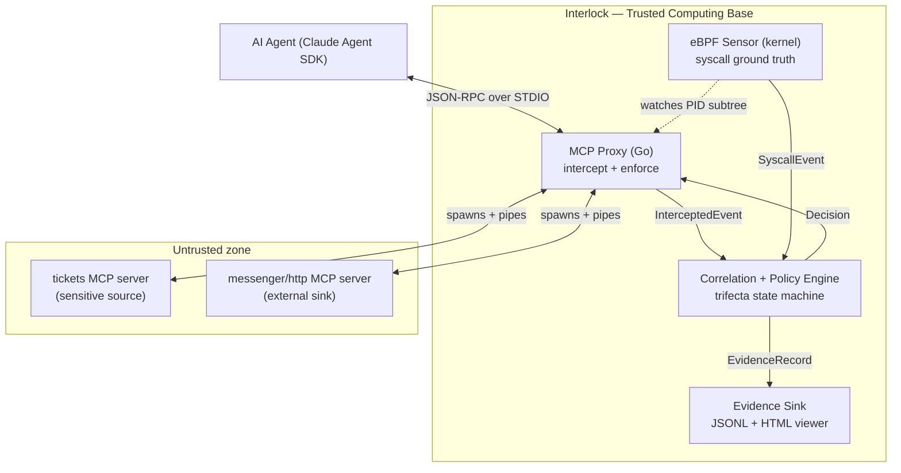

# Interlock — Architecture (v0.1)

## 0. Reading note

Interlock is a backend/systems tool, not a web app, so the usual buckets map like this:

- **"Frontend / backend boundary"** → the process and **trust** boundaries between the proxy, the kernel sensor, the correlation engine, and the read-only evidence viewer.
- **"State management"** → the per-session **trifecta state machine** plus cross-plane event correlation (§7).
- **"Database schema"** → the **event and evidence data model** (§8). v0.1 persists to memory + a JSONL evidence log; there is no external database.

---

## 1. Component topology



Four components, one binary (plus the kernel probes it loads): the **proxy** (Plane 1), the **eBPF sensor** (Plane 2), the **engine** (owns state and verdicts), and the **evidence sink + viewer** (the only "UI").

---

## 2. Trust boundaries

This is a security tool; boundaries are the design.

- **Untrusted:** MCP server processes (may be poisoned or outright malicious), all tool **results**, fetched web content, and — critically — **the agent's own outputs**, because the agent is the thing being hijacked. Interlock assumes the agent *will* be manipulated and does not trust its intent.
- **Trusted (TCB):** the proxy, engine, eBPF sensor, and config. Interlock **must not become the exfil path itself** — it never forwards a blocked call, holds minimal privilege beyond what eBPF requires, and performs **no network egress of its own** except writing local evidence.
- The agent sits **inside the untrusted zone** from Interlock's perspective. Detection is designed around behavior, not stated intent.

---

## 3. Data flow — life of a tool call

1. Agent emits a `tools/call` JSON-RPC request over STDIN → **proxy intercepts the frame**, parses it into an `InterceptedEvent` (direction = agent→server).
2. Engine runs a **pre-forward `EvaluateRequest`**: is this call an `external_sink`, and are the other two legs already lit for this session? If a trip fires here → **block** (Variant A) and synthesize an error result back to the agent; the call never reaches the server.
3. Otherwise the proxy **forwards** the frame to the child server over its STDIN.
4. Server executes and returns a result on its STDOUT → **proxy intercepts the result frame** → `InterceptedEvent` (direction = server→agent).
5. Engine **ingests the result**: if the tool is a `sensitive_source`, it **registers tainted values** and lights `sensitive_source_touched`; because all tool results are untrusted in v0.1, it also lights `untrusted_content_present`.
6. In parallel, the **eBPF sensor** streams `SyscallEvent`s from the proxy's PID subtree. A `connect()` from a *server child* to a non-allowlisted destination → `external_sink_invoked` candidate. If the other legs are lit → **trip** (Variant B): emit evidence + **kill the offending child** (containment).
7. On any trip, the engine writes an `EvidenceRecord` to the sink; the viewer renders it.

---

## 4. Plane 1 — the MCP proxy (Go)

**STDIO interposition.** Interlock launches the real MCP server as a **child process** and wires its stdin/stdout/stderr. Everything the agent writes toward the server, and everything the server writes back, passes through Interlock.

**JSON-RPC framing.** The MCP stdio transport carries newline-delimited JSON-RPC messages (one message per line, no embedded raw newlines). The reader **must buffer partial reads** — a single `read()` may contain a fragment, one message, or several. Do not assume one-read-one-message. *(Verify the exact framing against the current MCP stdio transport spec at implementation time; if any server uses LSP-style `Content-Length` header framing, handle that path too.)*

**Process lifecycle.** Deterministic startup ordering (spawn child, confirm it's alive, then accept agent traffic); graceful shutdown that drains in-flight frames; crash handling that surfaces a clean error to the agent rather than hanging; and **kill-on-detect** — the containment primitive Plane 2 uses for Variant B.

**Enforcement (hold-before-forward).** For requests, the proxy holds the frame, asks the engine, and only forwards on `Allow`. On block it **never forwards** and instead returns a synthesized JSON-RPC error (`"call blocked by Interlock: <reason>"`) so the agent gets a clean, legible failure.

---

## 5. Plane 2 — the eBPF sensor (kernel)

**Attachment.** Probes are scoped to the proxy's **process subtree** — the proxy PID plus every server child PID. Userspace maintains the live PID set and pushes it to a BPF map so the probes filter cheaply in-kernel.

**Probes (v0.1):**
- `connect()` — destination IP/port of every outbound connection.
- socket write / `sendto` — egress, with an optional **payload excerpt** (first N bytes, redacted) for kernel-side value-overlap.
- `openat()` — access to sensitive file paths.
- DNS resolution — names being looked up.

**Transport to userspace.** Perf/ring buffer → decoded in Go (`cilium/ebpf`) into `SyscallEvent`s.

**Detect-only in v0.1.** The kernel sensor **observes**; it does not block at the kernel. Containment happens in **userspace via kill-on-detect**. Kernel-level *blocking* (LSM/KRSI) is deferred to v0.2. Honest consequence: for Variant B the first packet may already be in flight when detection fires — Interlock **severs the channel** (kills the child) rather than perfectly preventing the first byte. Variant A (proxy) is true prevention; Variant B (eBPF) is detection + containment.

**Prototype-first.** Prove every probe as a **bpftrace one-liner** before writing a line of compiled eBPF. This de-risks the hardest week.

---

## 6. The correlation + policy engine

Consumes `InterceptedEvent` (Plane 1) and `SyscallEvent` (Plane 2); **owns `SessionState`**; emits `Decision`s (→ proxy) and `EvidenceRecord`s (→ sink).

**Correlation (syscall → session).** eBPF events carry a PID. The engine maps PID → {proxy \| specific server} → session via the PID set the proxy maintains. **v0.1 runs a single active session**, so the mapping is trivial — but every schema below carries `session_id` so multi-session is a wiring change, not a rewrite.

**Time alignment.** All events carry a monotonic timestamp (`ts_mono_ns`) from a shared reference. Syscall events are joined to recent proxy events within a **recency window** so a `connect()` can be attributed to the sensitive read that preceded it.

---

## 7. State management — the trifecta state machine

One state machine **per session**.

**The three legs** (each is a `Leg`: lit-flag + the event that lit it + a human detail):

- `sensitive_source_touched` — set when a tool tagged `sensitive_source` returns data.
- `untrusted_content_present` — set when content enters context from an attacker-controllable origin. **v0.1: all tool results and web fetches are treated as untrusted**, so in practice this lights alongside the first result.
- `external_sink_invoked` — set when a tool tagged `external_sink` is called, **or** an eBPF `connect()`/egress to a non-allowlisted destination fires.

**Tainted values.** When a `sensitive_source` returns data, the engine extracts candidate secrets and stores them as `TaintedValue`s — **hashed + masked, never raw** (§12).

**Evaluation & verdict tiers.** The machine evaluates the moment a sink fires:

| Condition at sink time | Verdict | Action (enforce mode) |
|---|---|---|
| All three legs lit **and** a tainted value appears in the sink's args/payload | `BLOCKED` (high confidence) | Prevent (Variant A) or kill child (Variant B) |
| All three legs lit, **no** value overlap | `FLAGGED` (lower confidence) | Configurable: block or warn-and-allow |
| Fewer than three legs lit | — | Forward normally |

**Reset semantics.** Legs are **session-scoped and sticky** — once lit, they stay lit for the life of the session. This is deliberately conservative for v0.1 (favor catching the attack over minimizing false positives). A new session starts clean.

**Concurrency.** Sessions are isolated; state is per-`session_id`. v0.1 exercises one at a time.

**Monitor / dry-run mode.** `enforcement: monitor` runs the full machine and emits evidence **without** blocking or killing — for tuning and for the "before" half of the demo.

---

## 8. Data model ("schemas")

The load-bearing contract. Getting this right **now** is what lets Weeks 2–3 plug in without a rewrite.

```go
// ---- Plane 1: proxy ----
type Direction string
const (
    AgentToServer Direction = "agent_to_server" // request
    ServerToAgent Direction = "server_to_agent" // response
)

type InterceptedEvent struct {
    SessionID   string          `json:"session_id"`
    Seq         uint64          `json:"seq"`            // monotonic per session
    TSWall      time.Time       `json:"ts_wall"`
    TSMono      int64           `json:"ts_mono_ns"`
    Direction   Direction       `json:"direction"`
    Method      string          `json:"jsonrpc_method"` // "tools/call", "tools/list", ...
    ToolName    string          `json:"tool_name,omitempty"`
    ToolArgs    json.RawMessage `json:"tool_args,omitempty"`  // requests
    Result      json.RawMessage `json:"result,omitempty"`     // responses
    ServerID    string          `json:"server_id"`
    ServerPID   int             `json:"server_pid"`     // key for eBPF correlation
    Tags        []string        `json:"tags,omitempty"` // ["sensitive_source"] | ["external_sink"]
    Decision    string          `json:"decision"`       // forwarded | blocked | pending
    BlockReason string          `json:"block_reason,omitempty"`
}

// ---- Plane 2: kernel ----
type SyscallEvent struct {
    TSMono         int64  `json:"ts_mono_ns"`
    PID            int    `json:"pid"`
    TID            int    `json:"tid"`
    Comm           string `json:"comm"`
    Syscall        string `json:"syscall"`      // connect | sendto | write | openat | dns
    DestIP         string `json:"dest_ip,omitempty"`
    DestPort       int    `json:"dest_port,omitempty"`
    Allowlisted    bool   `json:"allowlisted,omitempty"`
    Path           string `json:"path,omitempty"`            // openat
    PayloadExcerpt string `json:"payload_excerpt,omitempty"` // redacted first-N-bytes
    SessionID      string `json:"session_id,omitempty"`      // resolved via PID map
}

// ---- Engine state ----
type Leg struct {
    Lit        bool   `json:"lit"`
    TriggerSeq uint64 `json:"trigger_seq,omitempty"` // event that lit it
    Detail     string `json:"detail,omitempty"`
}
type TrifectaLegs struct {
    SensitiveSourceTouched  Leg `json:"sensitive_source_touched"`
    UntrustedContentPresent Leg `json:"untrusted_content_present"`
    ExternalSinkInvoked     Leg `json:"external_sink_invoked"`
}

type TaintedValue struct {
    Value        string `json:"-"`       // NEVER serialized raw
    Hash         string `json:"hash"`    // sha256(value)
    Preview      string `json:"preview"` // masked, e.g. "sk-...a9f2"
    Source       string `json:"source"`  // server/tool that produced it
    Seq          uint64 `json:"seq"`     // event that introduced it
    RegisteredAt int64  `json:"registered_at_ns"`
}

type Status string
const (
    Monitoring Status = "monitoring"
    Tripped    Status = "tripped"
    Terminated Status = "terminated"
)

type SessionState struct {
    SessionID    string         `json:"session_id"`
    Status       Status         `json:"status"`
    Legs         TrifectaLegs   `json:"legs"`
    Tainted      []TaintedValue `json:"tainted_values"`
    Confidence   float64        `json:"confidence"`
    Timeline     []uint64       `json:"timeline"` // ordered event seqs
    CreatedAt    int64          `json:"created_at_ns"`
    LastActivity int64          `json:"last_activity_ns"`
}

// ---- Evidence (feeds the viewer) ----
type Verdict string
const ( Blocked Verdict = "BLOCKED"; Flagged Verdict = "FLAGGED" )
type Variant string
const (
    VariantA Variant = "A_chained_tool"   // caught by proxy
    VariantB Variant = "B_server_channel"  // caught by eBPF
)

type EvidenceRecord struct {
    SessionID    string         `json:"session_id"`
    TripTS       int64          `json:"trip_ts_ns"`
    Verdict      Verdict        `json:"verdict"`
    Variant      Variant        `json:"variant"`
    Confidence   float64        `json:"confidence"`
    Legs         TrifectaLegs   `json:"legs"`
    SinkCall     any            `json:"sink_call"`             // the tool call or syscall that tripped
    ValueOverlap *OverlapHit    `json:"value_overlap,omitempty"`
    Timeline     []TimelineItem `json:"timeline"`              // full ordered story
}

type OverlapHit struct {
    TaintedHash string `json:"tainted_hash"`
    Preview     string `json:"preview"`
    WhereFound  string `json:"where_found"` // "sink args" | "egress payload"
}
type TimelineItem struct {
    TSMono int64  `json:"ts_mono_ns"`
    Kind   string `json:"kind"`   // intercepted | syscall
    Label  string `json:"label"`  // human line for the viewer
    Ref    uint64 `json:"ref,omitempty"`
}
```

---

## 9. Configuration model

A single `interlock.yaml` declares servers, tool tags, the egress allowlist, and enforcement mode.

```yaml
enforcement: block          # block | monitor
egress_allowlist:           # anything NOT here is treated as an external sink at the kernel
  - 127.0.0.1
  - api.anthropic.com
servers:
  - id: tickets
    command: ./servers/tickets
    provides_tags: [sensitive_source]
  - id: messenger
    command: ./servers/messenger
    provides_tags: [external_sink]
tool_tags:                  # per-tool overrides (authoritative)
  read_ticket: [sensitive_source]
  send_message: [external_sink]
  http_post:   [external_sink]
untrusted_origins:
  tool_results: true        # v0.1 default: all results untrusted
  web_fetches:  true
```

---

## 10. The evidence viewer ("frontend")

A **self-contained local HTML file** that reads one `EvidenceRecord` JSON and renders the timeline: a horizontal time axis, the three legs lighting up in sequence, the tainted-value highlight where it surfaces in the sink, and a big `BLOCKED`/`FLAGGED` badge with the variant label. **Read-only, no framework, no server.** "State" on the frontend is just the single evidence file — this is the money-shot visual, not an app.

---

## 11. Module boundaries / interfaces (Go)

Interfaces so components stay swappable and testable, and so the eBPF plane slots into the same engine the proxy already feeds.

```go
// Both proxy and eBPF sensor implement this.
type EventSource interface {
    Events() <-chan any   // yields InterceptedEvent or SyscallEvent
    Close() error
}

type Decision struct {
    Allow    bool
    Verdict  Verdict
    Reason   string
    Evidence *EvidenceRecord // set when a trip fires
}

type PolicyEngine interface {
    EvaluateRequest(ev InterceptedEvent) Decision // pre-forward gate (Variant A)
    Ingest(ev any)                                // results + syscalls; may trip (Variant B)
}

type Enforcer interface {
    BlockCall(sessionID, reason string)  // synthesize JSON-RPC error to agent
    KillProcess(pid int, reason string)  // containment for Variant B
}

type EvidenceSink interface {
    Emit(rec EvidenceRecord) error       // JSONL append + trigger viewer
}

type SessionStore interface {
    Get(sessionID string) *SessionState
    Upsert(s *SessionState)
}
```

---

## 12. Security of Interlock itself

- **Runs privileged** (loading eBPF, managing child processes). Drop capabilities aggressively once probes are attached; hold the minimum.
- **Never leaks the secrets it's protecting.** Tainted values are stored **hashed + masked** (`sk-...a9f2`), never raw. The value-overlap check compares hashes/normalized forms, and evidence stores only the masked preview. Interlock writing the token in plaintext to a log would make the tool *itself* an exfil path — forbidden.
- **Fail-open vs. fail-closed.** If the engine errors mid-session in enforce mode, does Interlock block or allow? **v0.1 default: fail-open with a loud warning**, to keep the dev/demo loop unblocked. A production posture would prefer **fail-closed**. This is a conscious tradeoff, revisited in Week 4 and flagged in the task list.

---

## 13. Deliberately absent in v0.1

HTTP/SSE transport, real dataflow taint (the value-overlap check is a heuristic — see project_overview §Non-goals), kernel-level blocking, multi-session correlation logic, and any UI beyond the read-only viewer. All tracked in `task_list.md` under Backlog.
